{: .center-image}

## Table of Contents

- [Introduction](#introduction)
- [UIAppearance technology?](#uiappearance-technology)
- [What is a theme in the first place?](#what-is-a-theme-in-the-first-place)
- [Theme model](#theme-model)
- [Theme manager](#theme-manager)
  - [Notifying via Observer](#notifying-via-observer)
  - [*Swift-y* Target-Action for flexibility](#swift-y-target-action-for-flexibility)
  - [Turning into a shared component](#turning-into-a-shared-component)
- [Wrap up](#wrap-up)

## Introduction

For today’s apps support for both light and dark appearances that users can toggle between has become the standard. While the light appearance, known as *Light Mode*, remains a classic theme, the appeal of the dark appearance, known as *Dark Mode*, is growing. Apart from having a more aesthetic look, *Dark Mode* is easier on your eyes for reading in dark ambient lighting conditions. And it also [drains the battery less on OLED screens][drains_battery_less_in_dark]. Nonetheless, support for the classic *Light Mode* is still actual, because, for example, it is better for reading in bright ambient lighting conditions. Consequently, we as app developers should ensure users have the possibility to choose a theme appropriate to their environment.

In September 2019 Apple finally released iOS 13 with full, system-wide *Dark Mode* support. Users can toggle between *Light* and *Dark modes* from a device’s settings and opt for desired interface style, and the system then uses an appropriate color palette for all screens, views, menus, and controls.

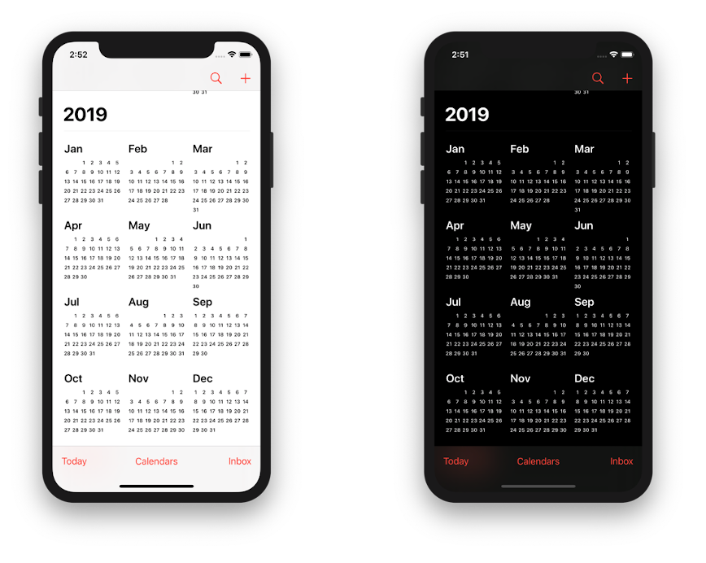{: height="100%" width="100%" .center-image }

When developing our apps, by using [semantically defined colors][ui_element_colors], [custom color assets][custom_color_assets], and [custom image assets for different appearances][custom_image_assets_for_different_appearances], we achieve the automatic adaptation of the app interface to a chosen system-wide mode. There is also a nice [Apple's WWDC Dark Mode introductory talk][implementing_dark_mode].

Nonetheless, there is still a huge amount of pre-iOS 13 devices in use, that do not have on-board *Dark Mode* support and it is not yet time to forget about them for good. For that reason, we still have to come up with a solution that works even for pre-iOS 13 devices.

## UIAppearance technology?

As long ago as 2011, Apple addressed the app theming with [UIAppearance][uiappearance]. Unfortunately, `UIAppearance` is not a big helper for us, as it hardly has upsides other than not needing to use a third-party library, while its downsides are:

- It does not allow toggling between themes “on the fly”. `UIAppearance` was designed to apply appearances only [once in a lifetime][once_in_a_lifetime], before a view is added to a window.
- `UIAppearance` is designed mostly for `UIView` subclasses, with some exceptions, like `UIBarItem`. But how can it be useful in the case of, say, `CALayer`?
- It is not concerned with theme semantics being a mere description of concrete UI element appearances, not so much as the [look and feel][look_and_feel] in its own right (more on this below).

So let's go ahead and develop a better solution!

We are going to start off with building up an idea of a *theme* as such.

## What is a *theme* in the first place?

In general, a *theme* is a concept of appearance that apps' UI elements adhere to. An app can provide different themes for the users to choose from, and the one chosen, a *current theme*, is a [single source of truth][SSoT] for rendering the app's entire interface appearance.

A *theme* is a collection of *themes attributes*, which should be defined in their own semantics, with clear intent, in terms of the UI in its entirety. An example of an aspect to represent with a theme attribute would be the background color or typeface across the whole app. The overall appearance characteristics of the user interface are commonly expressed with such categories as:

- Layout: Width, height, margin, floating or not, positioning, etc.
- Font properties: Size, weight, etc.
- Appearance: Colors, etc.

Each UI element renders its appearance by referring to theme attributes translating the abstract theme semantics into the one of itself.

Now that our underlying reasoning and subject area have been established, we are prepared for the goal of this post ― going through the steps of planning and developing the program code for our theme managing solution.

## Theme model

We are going to encapsulate a set of available theme attributes in the *theme model*. Distinct instances of the theme model will represent different themes.

Let's start off by defining our example theme model, as shown below.
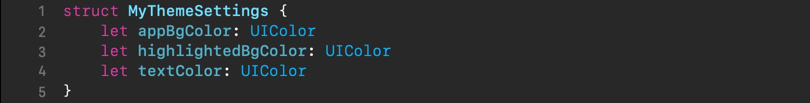{: height="100%" width="100%" }

We have used a value type, `struct`, to represent the theme model. Its properties will serve as the theme attributes. Our example theme model has got 3 of them:
* `appBgColor` for the app background color
* `highlihtedBgColor` for the highlighted text background color
* `textColor` for the normal text color

See how the theme attributes are different from concrete UI element attributes — they describe the appearance in general, i.e., they know nothing about concrete UI elements and bear the theme's own semantics.

For the next step we are going to define our example themes. It's convenient in *Swift* to retroactively encapsulate them as static properties right in the `MyThemeSettings` struct, with an extension.

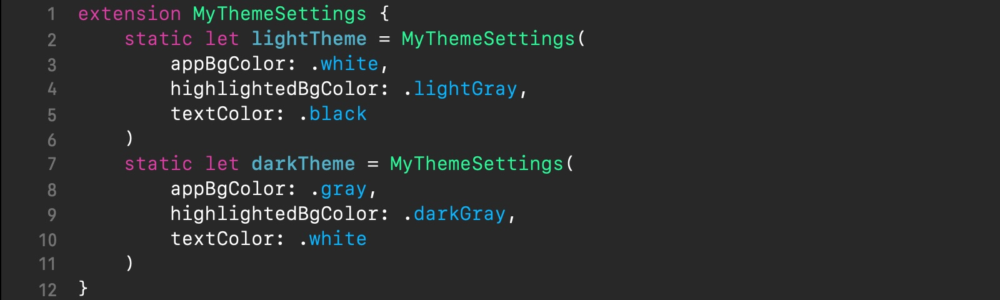{: height="100%" width="100%" }

Here we have got the instances `lightTheme` and  `darkTheme` for the light and dark themes, respectively.

For the means of referencing our themes from across the app, it is handy to make use of an enum, as shown in the example below.
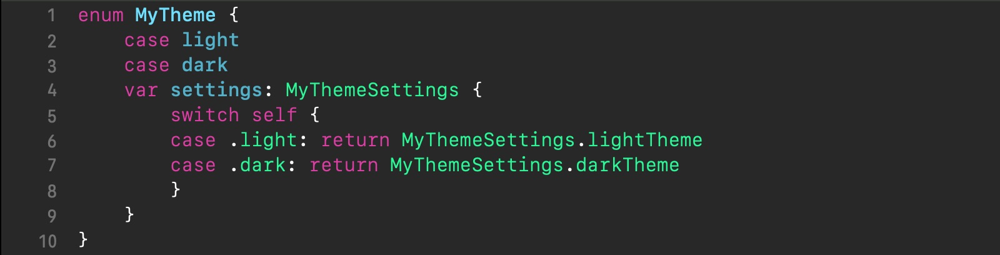{: height="100%" width="100%" }

The above enum has got two cases `light` and `dark` for our light and dark themes, which behave much like “tags”, each representing its related theme instance; the enum's computed property `settings` is responsible for the mapping.

With such an enum, dealing with themes in code will be a breeze. For example, referencing a theme in a variable is as easy as setting it to one of the enum's case labels, for example, `var currentTheme: MyTheme = .dark`. Getting to the theme attributes, for example, to the text color, would then be, like `currentTheme.settings.textColor`. Convenient, right?

And now let's proceed with our theme managing code itself.

## Theme manager

First of all, the last thing we want for our theme managing code ― to be scattered throughout the app. In order for the codebase to be maintainable, we have to design to the [SoC principle][Soc]. It means we should concentrate our theme managing code in one place. We are going to call it a *theme manager*. Let's outline its responsibilities:
1. maintain the available themes
1. provide the *current theme* to the themable UI elements (later on ― *themable objects*) for reference
1. *notify* the themable objects about changes of the current theme (by using some notification mechanism)

Now let's consider the theme manager from the perspective of accessing it from the other parts of the app. Structurally, the theme manager is a *dependency* of the themable objects, because it is them who consult it as to how to render themselves. But as a software component in its own right, the theme manager is totally independent of them. And what's more, it is also a so called [*ambient dependency*][singleton_vs_dependency_injection] because of arbitrarily spanning across multiple parts of the app. 

This, along with the 2 reasons below justifies using [Singleton Pattern][singleton_pattern] for *theme manager* instantiation and integration with the client app:
- There is no reason to have multiple instances of the *theme manager* at once.

- Not only does not the *theme manager* interfere with the app domain logic, but it does not share the app domain state, thus not impeding the app testability.

Besides, because of such architecture, unlike `UIAppearance`, this solution does not impose any limitation on which classes of themable objects it can be used with.

Now that we have laid the foundation, we are ready for proceeding with theme manager developing. We are going to walk through 3 stages of theme manager evolution — from the simplest to the advanced.

### Notifying via Observer

The principal part of the theme manager is the notification mechanism by which the themable objects get to know when the current theme's toggling occurs for them to update their appearance. Here is where [Observer Pattern][observer_pattern] comes in.

A tricky aspect about *Observer* pattern when dealing with it from [ARC][arc]-based languages, like *Swift*, is that to avoid retain cycles we need to keep observer references weakly. *Swift* offers a handy facility for this, the collection [`NSHashTable`][nshashtable] with [`weakObjects`][weakObjects], which we are going to take advantage of. Its prominent advantages are: 
* There is no need for manually taking care of memory management.
* It is very effective: it adds and accesses objects in constant time, *O(1)*. 

Let's start with creating a `Themable` protocol, that declares an API for the themable objects (i.e., the observers), which is going to be the type of `NSHashTable`'s stored elements, as shown below.

{: height="100%" width="100%" }

The only requirement of the `Themable` protocol is the `applyTheme(_:)` method, which is to be implemented by the observers, the themable objects. It will be called by the theme manager on every registered observer whenever the current theme toggles. `applyTheme(_:)` is the very method from which the themable objects will update their appearance and we are going to call it a *theme handler*.

Notice the `@objc` attribute in front of the protocol definition. It is to tell *Swift* that the protocol should be [compatible with *Objective-C*][compatible_with_objc] (*line 1*), what is the requirement for `NSHashTable`'s stored elements.

Now, let's define a class for the theme manager, called `ThemeManager`, as shown below.
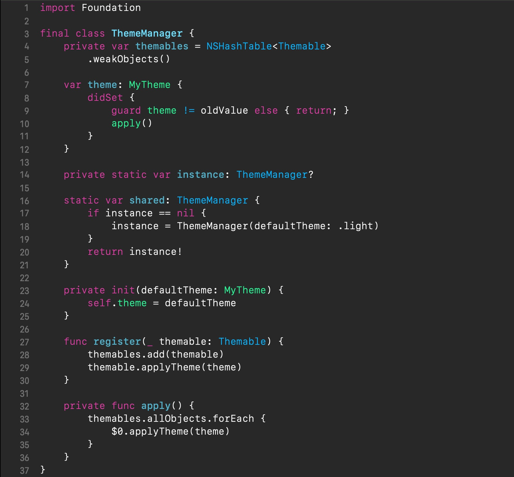{: height="100%" width="100%" }

In our above theme manager, the current theme is held in the `theme` property *(line 7)*. Whenever we need to switch the current theme, we would just set this property to another theme enum case and the `didSet` property observer will respond by triggering the `apply()` method for theme change notifying, which will iterate through all stored observers calling their method `applyTheme()` *(lines 33-35)*.

Now check out how [Observer Pattern][observer_pattern] is implemented:

* the `themables` property *(line 4)* is the storage for the observers
* the `register(_:)` method *(line 27-30)* is how new observers are registered
* the `apply()` method *(line 32-36)* is how the observers are actually notified

As mentioned, with [Singleton Pattern][singleton_pattern]  *(lines 14-21)* we are instantiating and maintaining a single instance of the theme manager.

Also, notice that the observer-notifying method `applyTheme()` is initially executed *(line 29)* right in the observer registration in order to apply the default theme. This implies that the observers should be ready for applying the theme at the *call sites* (where the method `register(_:)` is invoked). For example, for a view controller, a proper place for `register(_:)` invoking would be in the `viewDidLoad()` method.

Now we need a bit updated version of the originally introduced example of the enum `MyTheme`, as shown below.

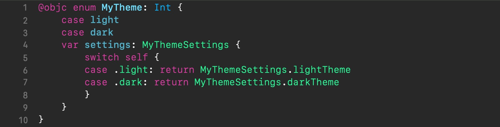{: height="100%" width="100%" }

In the above code, in contrast to the original enum, we have declared it with a raw type of `Int` and prefixed it with the [`@objc`][objc_enum] attribute *(line 1)*, or otherwise, the compiler would yell: *"Method cannot be a member of an @objc protocol because the type of the parameter cannot be represented in Objective-C"*.

That's it, our theme manager is completed. At this point, the themable objects can apply theming, as in the example shown below.

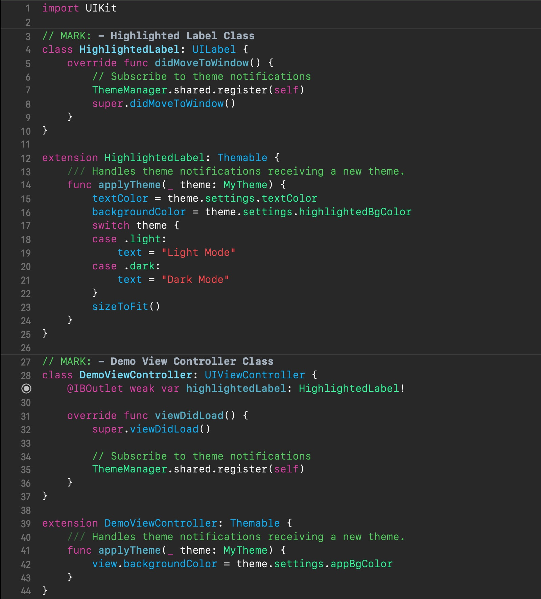{: height="100%" width="100%" }

For the purpose of illustrating the use of our theme manager, we have customized by subclassing a view controller naming it `DemoViewController` *(line 28)*. It simply displays an instance of an also customized by subclassing text label, `HighlightedLabel` *(line 4)*. 

By adopting the `Themable` protocol, the `HighlightedLabel` class *(line 12)* and `DemoViewController` class *(line 39)* have become valid themable classes, instances of which can be registered with our theme manager. The `HighlightedLabel` class is registering its instances from `didMoveToWindow()` method *(line 7)* and the `DemoViewController` class ― from its `viewDidLoad()` method *(line 35)*, both early in their lifecycle.

As mentioned before, during the process of registering themable objects, the theme manager performs initial execution of the `applyTheme(_:)` method of those, i.e., their theme handler. In the given code the theme handlers are defined in the extensions adding the `Themable` protocol conformance *(lines 14-24, 41-43)*. The `applyTheme(_:)` method will be called by the theme manager every time whenever the current theme changes.

Find an example of the complete demo app [here][demo_example_observer].

Now let's see if we can make things a bit more interesting. Our theme manager works just fine. It can also provide more flexibility by using subclassing in such a manner when a subclass refines theming, done in its superclass. However, there are times when we need a higher flexibility degree than that, like when our app interface uses specific, say, text labels that need to appear different from the others for the same theme, or, in other words, when we need a per-instance theming granularity. It means that the level of dynamism our solution provides is insufficient, and we might go for a more runtime-oriented solution with fewer compile-time restrictions on theme handling code. So, let's go ahead and level up our theme manager.

### Swift-y Target-Action for flexibility

Getting the desired theming flexibility with a per-instance theming granularity requires us to be able to loosely define multiple theme handlers in order to provide them for different instances. Mere abstracting out of the themable observers (via `Themable` protocol adherence) with a unified theme handler method is too restrictive and so inappropriate any more. And we have at our disposal the following 2 facilities with the sufficient level of dynamism:

- **[Closures][closures]**. *Closures* are self-contained blocks of functionality that can be passed around and used in our code.
- **[Target-Action][target_action_wiki]**. In essence, *Target-Action* is a mechanism that allows sending an *action* (or message) to a certain *target* when an even occurs.

*Closures* are extremely flexible and prominently used in *Swift* everywhere. Still, the code using closures sometimes can be prone to strong reference cycles incurring the overhead of maintaining [capture lists][capture_lists] on you, thus resulting in the app's theming code being more complex and also a bit untidy when compared to the Target-Action technique. For that reason, I find the Target-Action technique more preferable for our task.

Although *Target-Action* originates from *Objective-C*, there also happens to exist a [*“Swift-y” version of Target-Action*][swift_instance_methods_are_curried_functions], which is based on the *“Currying”* nature of *Swift* instance methods. This makes trying out this technique in practice especially interesting. So, now we are going to update our theme manager to employ *Swift-y Target-Action*, where the *target* will represent a themable object and *action* ― a theme-handling method.

While our original theme manager stored the references to the themable objects, now it will need to store the *target-action* pairs, which will represent the theme handlers from now on. As per [*Swift-y Target-Action*][swift_instance_methods_are_curried_functions] pattern, we need to declare the `TargetAction` protocol and define the `AnyTargetActionWrapper` struct adopting it, as shown below.
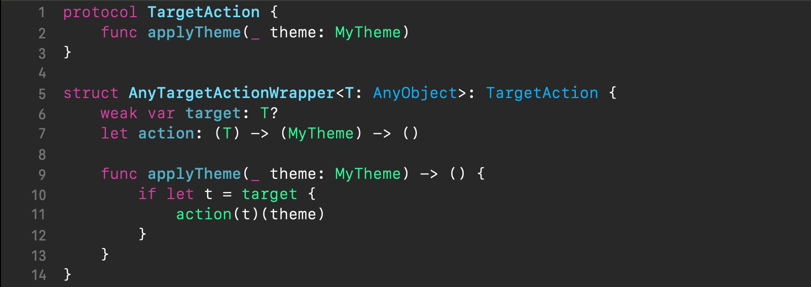{: height="100%" width="100%" }

Basically, the `AnyTargetActionWrapper` struct is a container for a *target-action* pair. Let's break it down:

* It is generic, parameterized by its stored target's type `T`; it employs [*type erasure*][type_erasure] to hide the actual type of the target.
* It references the stored target weakly preventing retain cycles *(line 6)*.
* It stores the action in the *curried* form, i.e., in the form of a closure taking the target as the first parameter, thus making up the target's instance method reference, which then takes its declared parameters *(line 7)*. For more details, check out the [Swift-y Target-Action article][swift_instance_methods_are_curried_functions].

So far, so good, but now comes the question: where should we store theme handlers? The critical factor is that the lifetime of multiple theme handlers should be tied with that of their related targets. Previously, with the `Themable` protocol adherence, we referred to a theme handler through a themable object reference. Because those references were stored in a [`NSHashTable`][nshashtable] (with [`weakObjects`][weakObjects]) themable storage, when a themable object deallocated, its reference automatically removed from the storage. But now, it is the lifetime of a whole group of theme handlers that depend on a target, rather than that of an individual theme handler. And so we should come up with a solution for storing separate groups of theme handlers for individual targets.

*Swift* is very powerful and one of its outstanding capabilities is [retroactive modeling through the use of protocol extensions][retroactive_modeling]. It allows declaring a protocol, extending it with some functionality, and by [declaring protocol adoption with an extension][decl_protocol_adoption_with_extension], easily "injecting" that added functionality into an arbitrary type ― it looks like the most elegant solution. Thus, for our task, we could declare, for example, a `ThemableStorage` protocol, use *Swift* extensions to add a property for the theme handler storage to this protocol, and then, by declaring that protocol adoption for a themable object' type, we could easily attain what we need ― a theme handler storage's lifetime tied with that of the targeted themable object. Unfortunately, this is not the case, because, as for now, *Swift* lacks the support of adding *stored* instance properties with an extension.

For our task, *Associated Objects* will come to the rescue. This facility is based on the *Objective-C* runtime function `objc_setAssociatedObject()` which allows making associations between one object and others, distinguished by unique associated keys. Its counterpart function, `objc_getAssociatedObject()`, is to retrieve a previously established association by the associated key. And this is how we are going to tie theme handler storages' lifetimes with their related targets. Let's write a class for our theme handler storage, called `TargetActionStorage`, encapsulating the said mechanism as well as taking over the notifying of the stored theme handlers, as shown below.
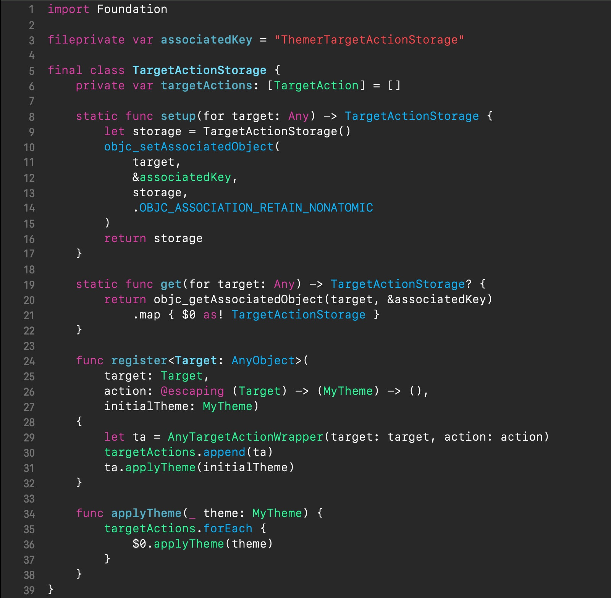{: height="100%" width="100%" }

In the first place, the above class has two static methods for instantiating and retrieving targets' associated storages for theme handlers, `setup(for:)` and `get(for:)`, which both take a targeted object as an argument. In essence, these methods are wrappers over `objc_setAssociatedObject()` and `objc_getAssociatedObject()`, respectively. For the associated key we are using a reference to a unique string value in the mutable global variable `associatedKey` *(line 3)*.

Next comes *Observer Pattern*'s part *(lines 6, 24-38)*, which comprises the following instance methods:

* `register(target:action:initialTheme:)` This method wraps up and stores the passed target-action pair in the `targetActions` property *(line 6)*, and then executes the passed action to initially apply the current theme passed in the `initialTheme` argument.
* `applyTheme(_:)` Whenever the current theme changes, the theme manager would invoke this method to notify the stored theme handlers. It iterates through the `targetActions` array and runs the stored actions. This method takes a new current theme as the `theme` parameter.

Now let's go ahead and finally update our theme manager, as shown below.
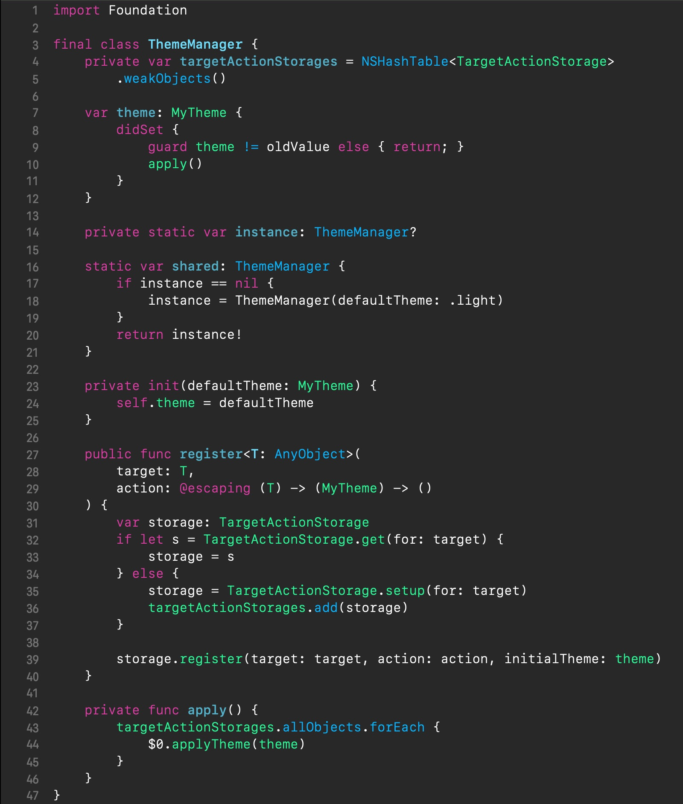{: height="100%" width="100%" }

In the above theme manager, in contrast to the original version, except for changing the storage property name to `targetActionStorages` and its element type to `TargetActionStorage` *(line 4)*, there has significantly changed the lower part *(lines 27-46)*.

Now, when the `register(target:action:)` method gets called to register a new theme handler, it first obtains the passed target's associated storage by either retrieving an existing one *(line 32)* or instantiating a new one *(line 35)*. Then it delegates registering the new theme handler to the obtained storage (*line 39*). Besides that, whenever a new storage gets created, it is also weakly preserved in `targetActionStorages` (*line 36*).

Similarly as before, upon the current theme change, the `theme` property observer triggers theme handler notifying by calling the `apply()` method. But now, the storages preserved in the `targetActionStorages` property are iterated through to run their stored theme handlers for a new current theme (*lines 43-45*).

BTW, here we have used the original `MyThemeModel` and `MyTheme`, introduced in [Theme model section](#theme-model), with no changes.

Now that the new theme manager has been designed, let's see how it can be integrated with themable objects in practice to illustrate the advantages of this approach.

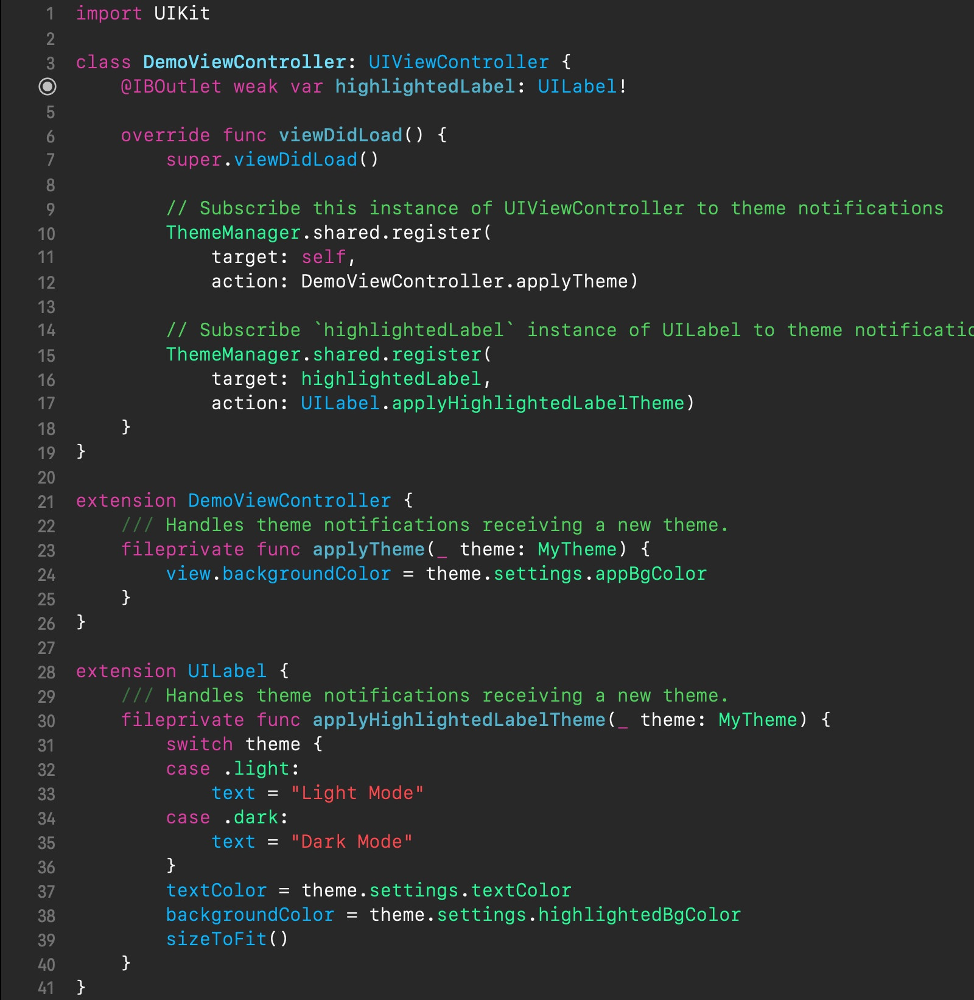{: height="100%" width="100%" }

In the code above, first off, we don't need anymore any `Themable` protocol adherence for our UI elements to be themable objects.

Our `DemoViewController` has not changed fundamentally. We have defined its single theme handler `applyTheme(_:)` in an extension *(lines 23-25)* and registered it with the theme manager from the `viewDidLoad()` method *(line 10)*, similarly as before. Overall, it is no different from the previous customizing by subclassing to add theming.

However, things have gone differently for the highlighted label. In the same source file as for `DemoViewController` we are extending the `UILabel` class to add the `applyHighlightedLabelTheme(_:)` method to be a theme handler for our instance of the highlighted label. We are also registering it with the theme manager from the view controller's `viewDidLoad()` method *(line 15)*. This, along with the use of the scope isolating `fileprivate` access modifier for the label's theme handling method *(line 30)*, has the effect of theming with a per-instance granularity, when we can apply theming just to specific instances of a themable object, not so much as for the whole class. Such an elegant per-instance theming allows us to reinforce the [SoC principle][Soc]. Notice, that we could just as well have had multiple differently-named theme handlers defined for the same instance.

Find a complete example of the app demonstrating our *Swift-y Target-Action*-based theme manager [here][demo_example_swifty_target_action].

Now, time for the bonus round. We have developed a pretty flexible theme manager, so far, but let's go even further and think about it from the code organization perspective. Any application consists of a bunch of different by functionality components; the cleaner responsibilities and better isolation of the components from one another, the more *reusable*, *testable*, *maintainable*, or in one word ― [*modular*][modular_programming] they are. Besides, it is common for a well-designed component to be even *shared* across multiple projects, and our theme manager is a good candidate for such a [*shared* component][shared_component] too.

### Turning into a shared component

Even though our theme manager encapsulates theming-related functionality with well-defined responsibilities, it hardly makes a *shared* component so far because it is tightly coupled to the client app. The critical point is that it is dependent on concrete types, the `MyThemeSettings` struct and `MyTheme` enum, that belong to the client app's *domain* logic. This problem can be fixed by abstracting those types out, so as the theme manager code would not refer to the client app's types, making the theme manager and the client app loosely coupled. So, let's go ahead and level up our theme manager by evolving it into a *shared*-ready, robust component.

Basically, the code is not going to change dramatically from the preceding one, for the most part; in essence, it is a mere generifying of the previous version's types. So, I am just going to present the updated snippets from before and briefly comment on what has changed.

First and foremost, in our preceding theme manager, wherever we referenced the client app's `MyThemeSettings` struct and `MyTheme` enum, we will need to transition to referencing the protocols `ThemeModelProtocol` and `ThemeProtocol` instead, which are presented below.

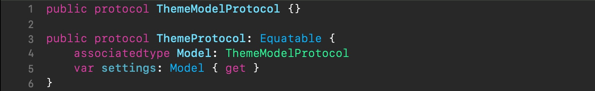{: height="100%" width="100%" }

Besides, the above two protocols are to be adopted by the client app's theme model struct and theme enum, respectively. With such a design, we will decouple our theme manager code from the client app, and both of them will depend on the same abstractions ― protocols.

In the above code, in the `ThemeProtocol` protocol declaration, we are referencing the client app's actual theme model type *(line 5)* via the *associated type* `Model` (*line 4*), meaning that `ThemeProtocol` has become an [abstract protocol][abstract_protocols], with all its implications.

The `ThemeProtocol`'s conformance to `Equatable` makes the theme enum cases comparable.

As already mentioned, the types `MyThemeSettings` and `MyTheme`, which are on the client app's side, should conform to the just-introduced protocols, as in the example below.

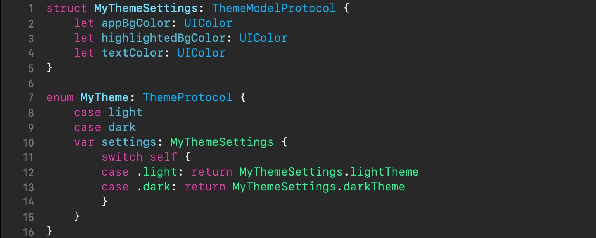{: height="100%" width="100%" }

In the above code, for the `MyTheme` enum, the compiler is capable of inferring `ThemeProtocol`'s associated type `Model` eliminating the need for the use of `typealias`.

Next up, let's adapt the preceding theme manager's `TargetAction` protocol and `AnyTargetActionWrapper` struct to fit in with our above protocols, as shown below.

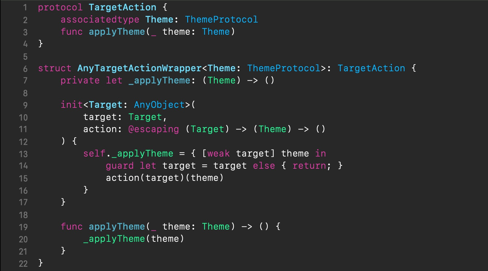{: height="100%" width="100%" }

In the above code, the `TargetAction` protocol has become abstract because of introducing the associated type `Theme` to represent the client app's actual theme enum. The `AnyTargetActionWrapper` struct has become generic, parameterized by the type parameter `Theme`, which is for the same reason.

Next up, let's update the `TargetActionStorage` class, as shown below.

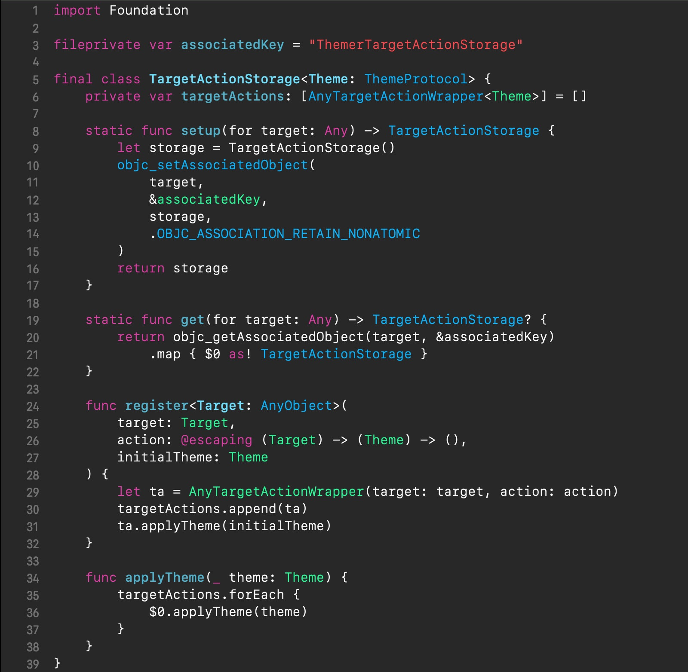{: height="100%" width="100%" }

In the above code, the same type parameter `Theme` (to represent the client app's actual theme enum type) has been introduced too, which is passed through to the `targetAction` property definition to specialize the target-action storage elements' generic type (*line 6*). Also, `Theme` has replaced the previously used concrete theme enum type in the type annotation of:

* the two arguments of the `register(target:action:initialTheme:)` method *(lines 26, 27)*
* the argument of the `applyTheme(_:)` method *(line 34)*

Finally, let's update our theme manager generifying it with the same type parameter `Theme` and renaming it to `Themer`, as shown below.

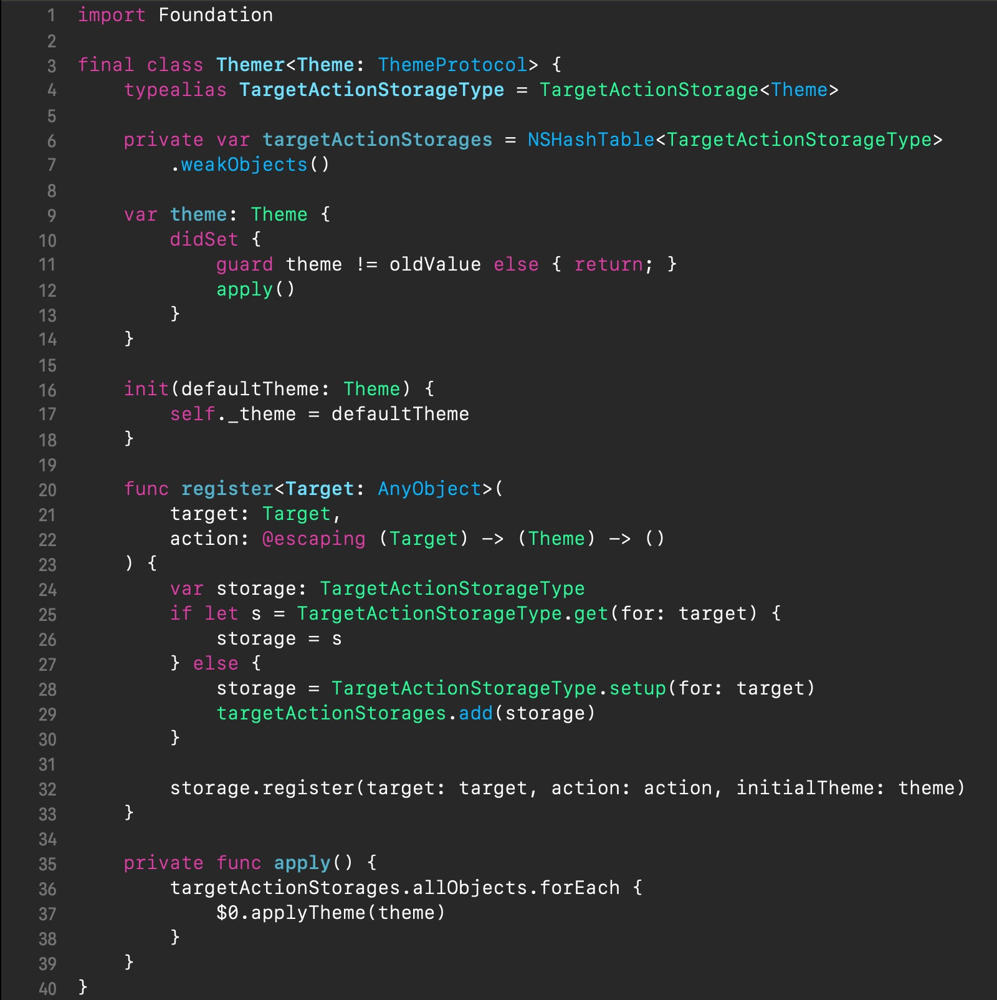{: height="100%" width="100%" }

In the above code, the type parameter `Theme` has been passed through to the `targetActionStorages` property definition to specialize its stored element's generic type (via the use of the `TargetActionStorageType` typealias) (*line 6*), as well as it has replaced the previously used concrete theme enum type in the type annotation of:

* the `theme` property *(line 9)*
* the initializer's `defaultTheme` argument *(line 16)*
* the `action` argument of the `register(target:action:)` method *(lines 22)*

The other important change is that we have got rid of the singleton code from the theme manager class because it does not agree well with the theme manager reusability. Instead, we will have to place it somewhere in the client app, as shown in the code below.

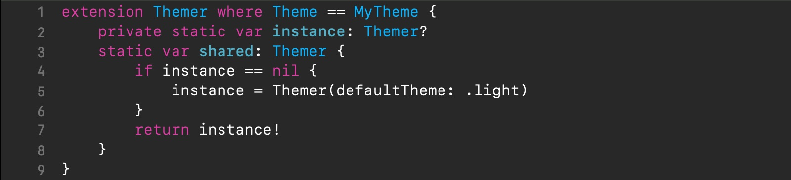{: height="100%" width="100%" }

In fact, the last code snippet represents the “integration point” between the client app and our shared theme manager.

That's it. Our *shared*-ready theme manager is done now. Making a module out of it is beyond the scope of this post, though it's trivial. You can find the git repo of our shared-ready theme manager [here][themer], which also addresses some other necessities of real-world apps, like thread-safety, which are beyond the scope of this post as well.

A final complete example of the app, demonstrating the use of our shared-ready theme manager is available [here][demo_example_reusable].

## Wrap up

In this article, we have created and honed a universal app theming solution by developing a robust, shared-ready theme manager, that works well both on iOS 13, featuring the system-wide Dark Mode, and on older iOS versions. Our theme manager allows easy toggling the current theme across the whole app. We started off with simple *Observer*-based notifying. Then we introduced [*Swift-y Target-Action*][swift_instance_methods_are_curried_functions] theme handlers to achieve greater flexibility and reinforce the [SoC principle][SoC]. And finally, we abstracted our theme manager out and made a reusable software component out of it, ready for the use across multiple apps.

Hope you found this post interesting and useful for your projects. If you have anything additional to share on this subject, please leave a comment below. I would love to hear your thoughts and findings.

Thanks for reading! 🙂

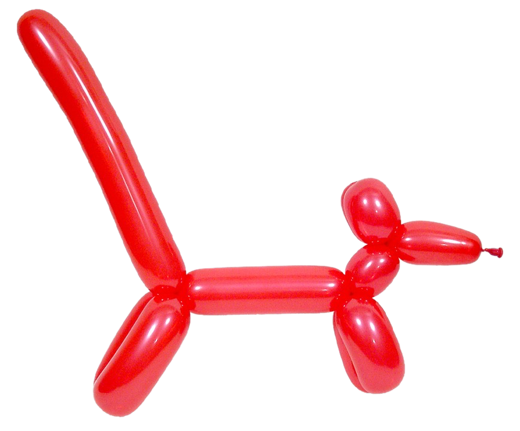{:height="50%" width="50%" .center-image }

[drains_battery_less_in_dark]: https://www.thejournal.ie/black-background-battery-power-2700675-Apr2016/
[ui_element_colors]: https://developer.apple.com/documentation/uikit/uicolor/ui_element_colors "UI Element Colors"
[custom_color_assets]: https://developer.apple.com/documentation/xcode/supporting_dark_mode_in_your_interface#2993897 "Choose Adaptive Colors for Your UI"
[custom_image_assets_for_different_appearances]: https://developer.apple.com/documentation/uikit/uiimage/providing_images_for_different_appearances "Providing Images for Different Appearances"
[implementing_dark_mode]: https://developer.apple.com/videos/play/wwdc2019/214/ "Implementing Dark Mode"

[uiappearance]: https://developer.apple.com/documentation/uikit/uiappearance "UIAppearance"
[once_in_a_lifetime]: https://developer.apple.com/documentation/uikit/uiappearance#overview

[look_and_feel]: https://en.wikipedia.org/wiki/Look_and_feel

[SSoT]: https://en.wikipedia.org/wiki/Single_source_of_truth "Single Source of Truth"
[SoC]: https://en.wikipedia.org/wiki/Separation_of_concerns "Separation of Concerns Principle"
[singleton_vs_dependency_injection]: https://enterprisecraftsmanship.com/posts/singleton-vs-dependency-injection/#_singleton_vs_dependency_injection "Singleton vs Dependency Injection"
[singleton_pattern]: https://en.wikipedia.org/wiki/Singleton_pattern "Singleton Pattern"
[observer_pattern]: https://en.wikipedia.org/wiki/Observer_pattern "Observer Pattern"
[arc]: https://docs.swift.org/swift-book/LanguageGuide/AutomaticReferenceCounting.html "Automatic Reference Counting"
[nshashtable]: https://developer.apple.com/documentation/foundation/nshashtable "NSHashTable"
[weakObjects]: https://developer.apple.com/documentation/foundation/nshashtable/1412241-weakobjects "weakObjects()"
[compatible_with_objc]: https://docs.swift.org/swift-book/LanguageGuide/Protocols.html#ID284
[objc_enum]: https://developer.apple.com/swift/blog/?id=22
[demo_example_observer]: https://github.com/SergeBouts/blog-samples/tree/master/ThemeManagerDemo-Observer "Theme Manager, Observer approach demo"
[dry]: https://en.wikipedia.org/wiki/Don%27t_repeat_yourself "Don't Repeat Yourself Principle"
[closures]: https://docs.swift.org/swift-book/LanguageGuide/Closures.html "Closures"
[target_action]: https://developer.apple.com/library/archive/documentation/General/Conceptual/Devpedia-CocoaApp/TargetAction.html "Target-Action Pattern"
[target_action_wiki]: https://en.wikipedia.org/wiki/Target–action
[capture_lists]: https://docs.swift.org/swift-book/LanguageGuide/AutomaticReferenceCounting.html#ID56 "Capture Lists"
[swift_instance_methods_are_curried_functions]: https://oleb.net/blog/2014/07/swift-instance-methods-curried-functions/ "Instance Methods are “Curried” Functions in Swift"
[type_erasure]: https://medium.com/@bobgodwinx/swift-associated-type-design-patterns-6c56c5b0a73a
[retroactive_modeling]: https://www.e-gineering.com/2019/07/31/swift-essentials-protocols/#:~:text=Protocol%20Extensions
[decl_protocol_adoption_with_extension]: https://docs.swift.org/swift-book/LanguageGuide/Protocols.html#ID278
[demo_example_swifty_target_action]: https://github.com/SergeBouts/blog-samples/tree/master/ThemeManagerDemo-SwiftyTargetAction "Theme Manager, Swifty Target-Action approach demo"
[shared_component]: https://itnext.io/how-to-easily-reuse-components-across-projects-and-repositories-fa73f8ba2a83 "How to Easily Reuse Components Across Projects and Repositories"
[abstract_protocols]: http://www.russbishop.net/swift-associated-types
[themer]: https://github.com/SergeBouts/Themer "Themer"
[demo_example_reusable]: https://github.com/SergeBouts/blog-samples/tree/master/ThemeManagerDemo-Reusable "Theme Manager, Reusable Swifty Target-Action approach demo"
[modular_programming]: https://en.wikipedia.org/wiki/Modular_programming
