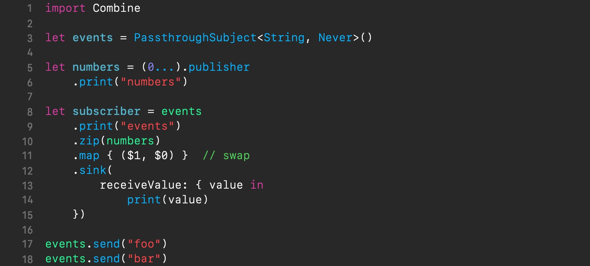
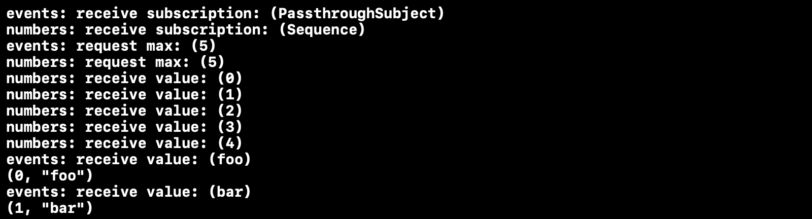

{: .center-image}

## Table of contents

- [Intro](#intro)
- [So what’s the problem?](#so-whats-the-problem)
- [The scan-based solution](#the-scan-based-solution)
- [The alternatively behaved zip solution](#the-alternatively-behaved-zip-solution)
- [Wrap up](#wrap-up)

## Intro

Apple's Combine, a [reactive programming][reactive_programming] (RP) framework, was developed for heavy use and with achieving the maximum flexibility and performance in mind. Being deeply integrated with other proprietary components, at a low level, it is closed source. Combine generally won't be that hard to start to use for those who are already familiar with other RP frameworks. But as new software, it's still lacking documentation and practical examples of solutions for the real-world usage scenarios.

Let's briefly refresh our memory of what RP is about. In essence, RP is all about representing and transforming discrete value sequences (data streams). Apart from values, sequences also operate with completion and error events. Sequences split into two groups: *static* and *dynamic*.

{: height="100%" width="100%" .center-image }

Static sequences are those whose values are available all at once, like regular arrays. But dynamic sequence values are emitted over time and their source may be, for example, the user typing on the keyboard. Another important property of sequences is whether they are bounded-size or not.

The major reason why RP is gaining increasing popularity is the asynchronous nature of the real-world tasks, like interactive user interfaces, which are greatly modeled with dynamic sequences. In Combine a sequence is represented by the term *publisher*. It provides various publishers of both natures, dynamic (like *subjects* and *future*s), and static (like array and range *publishers*).

RP is one of the major topics of personal interest to me; therefore, I'm going to occasionally share my own insights gained in the process of Combine exploration.

In this post, I wanna bring up one specific issue that I came across when devising a zip operator-based solution for enumerating events.

## So what’s the problem?

Say, we have some arbitrary, infinite source of events, a dynamic publisher, and need to get the events enumerated by assigning each event a unique serial number. The most straightforward approach that comes to mind is the one based on the *zip* operator.

To refresh our memory, the *zip* operator's marble diagram is shown below.

{: height="100%" width="100%" .center-image }

`zip`  waits until both upstream publishers, `a` and `b`, have emitted, then delivers the oldest unconsumed event from each one together as a tuple to the downstream subscriber.

The point of the idea is introducing another publisher, a static one, like `(0..<100).publisher`, to produce serial numbers, then combining both of them with the *zip* operator into a single pipeline. The following example illustrates the idea *(you can use playgrounds in Xcode to execute the snippets from this post.)*

{: height="100%" width="100%" .center-image }

<a href="https://gist.github.com/SergeBouts/96eac312b4c9d8ed5f24936aa90ba2d1" target="_blank">Click for Gist</a>

The above code produces the following output to the console.

{: height="100%" width="100%" .center-image }

The solution is simple and clear. So far, so good, our code works. However, because the serial number publisher in our example is bounded-size (limited by a quantity of 100 values (*line 5*)), the code stops execution after enumerating the maximum of a hardcoded specific number of values. To correct the problem let's remove the upper bound from the serial number publisher's range by re-writing it as `(0...).publisher`, and thus converting it into an unbounded-size publisher.

Now, if we run the code, we're going to find the pipeline in a never-ending loop producing an infinite sequence of serial numbers printed out to the console. Why is that? To find out what's causing the problem it makes sense to try analyzing the output of the debugging operator *print* for both the serial number publisher *(line 5)* and input event publisher *(line 7)*. Let's modify the example as shown below.

{: height="100%" width="100%" .center-image }

<a href="https://gist.github.com/SergeBouts/0c384f7dae075aa21604105a421a64e7" target="_blank">Click for Gist</a>

Now, after running the code again with breaking the execution after a while, let's check out the top of the console output.

{: height="100%" width="100%" .center-image }

The first two lines indicate passing the subscription from both of the publishers. The third and fourth lines indicate making by the *zip* operator demand request for *unlimited* number of values for *both* publishers. And now it seems to make sense: as soon as the serial number publisher obtains control it never stops emitting values in satisfying the infinite demand request. With finite demand, this works alright, because when the serial number publisher finishes, the entire sequence is buffered and then those numbers are used for pairing up with the source values.

But why does Combine's *zip* operator ever send its upstreams the *unlimited* demand request? Well, we can assume that it just forwards, upstream, the requested demand from its downstream subscriber, which is the *sink* operator, known to send the *unlimited* initial demand. To check if this hypothesis is true we'll need to be capable of explicitly specifying the initial demand by the subscriber. And we're going to take advantage of a custom *sink* instead of Combine's provided one, whose code can be found [here][custom_sink]. The following code is the updated example from above with the custom *sink* in place to specify a *finite* initial demand of 5 values *(line 13)*.

{: height="100%" width="100%" .center-image }

<a href="https://gist.github.com/SergeBouts/667acb426d2fbfd1cd58656e3134f474" target="_blank">Click for Gist</a>

Now, the code executes successfully, without any hanging up. Here's its full output from the console.

{: height="100%" width="100%" .center-image }

Of what's new, first, we see that both publishers' demand requests now have a *finite* value, 5. Next, there follow 5 values emitted by the serial number publisher. Finally, we can observe how the control is passed to the input event publisher which emits 2 values, "foo" and "bar", each followed by the *zip* operator's emission. So, our hypothesis proves true: Combine's *zip* operator just forwards the demand received from its subscriber!

Is this behavior absolutely correct for the *zip* operator? Well, undoubtedly Apple had good reasons for implementing the *zip* operator this way, still, I find this odd, because this is an example of when Combine's *static* and *dynamic* publisher just don't fit well together.

## The scan-based solution

For event enumeration, we can always go for another simple approach based on the *scan* operator which has proved to work well on Combine in all situations.

To refresh our memory, the *scan* operator's marble diagram is shown below.

{: height="100%" width="100%" .center-image }

`scan` transforms elements from the upstream publisher by providing the current element to the closure along with the last value returned by the closure. 

The scan-based code for event enumeration is provided below.

{: height="100%" width="100%" .center-image }

<a href="https://gist.github.com/SergeBouts/4248e25f41c8a21643763f12fd4b527d" target="_blank">Click for Gist</a>

In the code above, we are using a stateful *scan* operator to keep track of the latest issued serial number in the accumulator and deliver it in pairs (as tuples) with its corresponding input value to the downstream subscriber.

## The alternatively behaved zip solution

I believe the intuitive behavior for the *zip* operator would be the following: whatever demand *zip* receives from its downstream (except for 0, in which case it should also send 0 upstream), it should always send a demand for only one value to its upstreams, then wait for the response from each of them, then emit the result downstream, closing the round. And repeat the rounds until the demand gets exhausted.

I have developed an alternative to Combine's original *zip* operator, which behaves in the manner described above and is applicable for enumerating any values, no matter whether the source publisher is finite or infinite. This solution allows seamless combining both worlds ― *dynamic* and *static* publisher, when the *zip* operator is concerned. However, a detailed discussion of it is out of scope of this blog post. It is available in the [xCombine repository][xcombine_repository] where you can check its source code out. The example demonstrating it is shown below.

{: height="100%" width="100%" .center-image }

<a href="https://gist.github.com/SergeBouts/df8ea42aa5f0149e193c2a6f733af634" target="_blank">Click for Gist</a>

Notice how in the example we are opting for xCombine's version of the *zip* operator by prepending it with the `x` property *(line 9)*.

## Wrap up

In this blog post, we've looked into the odd behavior of Combine's *zip* operator in one of the common real-world usage scenarios and explored a couple of solutions.

Thanks for reading 🎈

[reactive_programming]: https://en.wikipedia.org/wiki/Reactive_programming
[custom_sink]: https://github.com/SergeBouts/blog-samples/blob/master/Misc/CustomSink.swift
[xcombine_repository]: https://github.com/SergeBouts/XCombine

