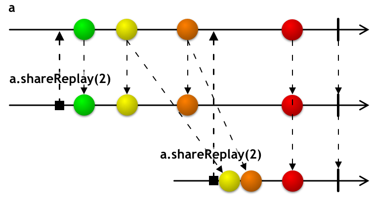
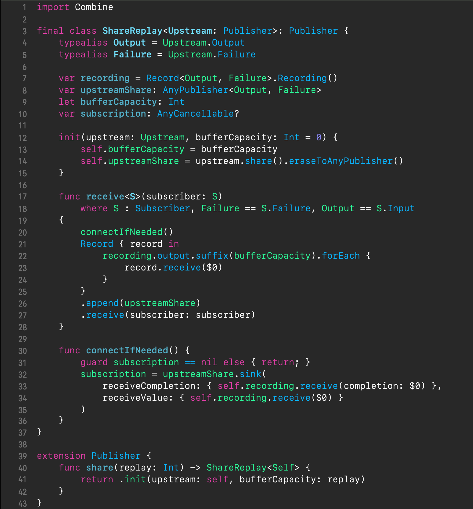
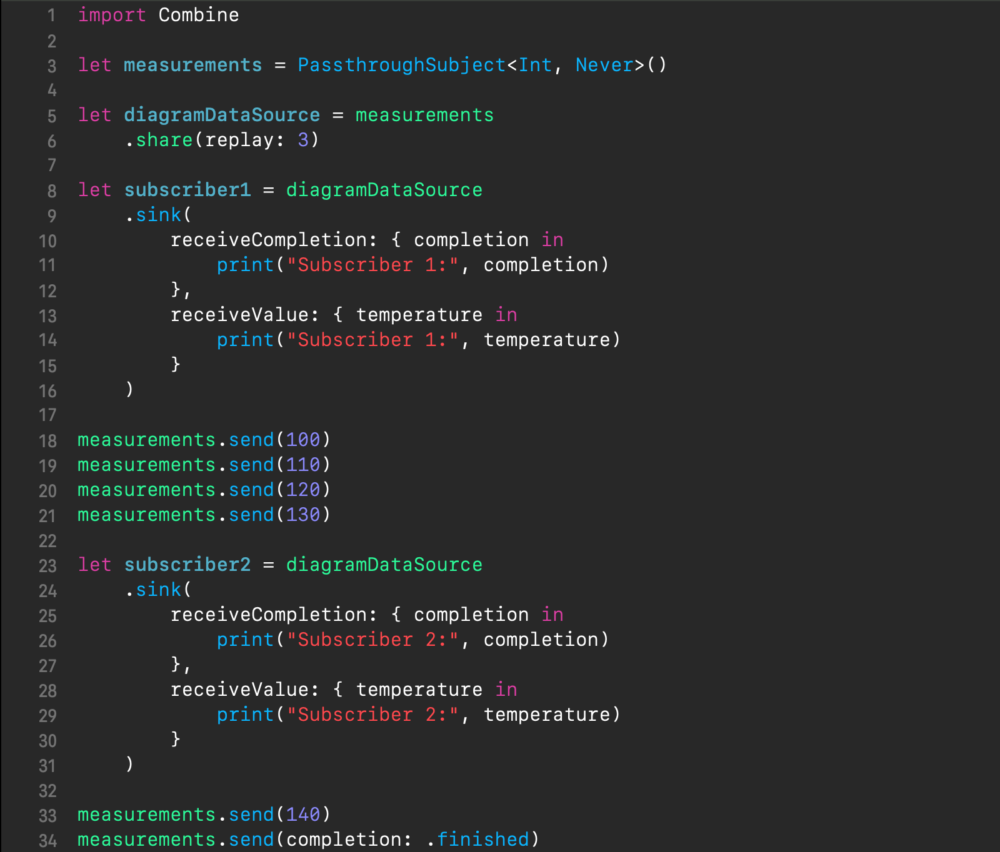

{: .center-image}

## Table of contents

- [Intro](#intro)
- [Devising a solution](#devising-a-solution)
- [Downsides](#Downsides)
- [Looking for a better solution](#looking-for-a-better-solution)
- [Wrap up](#wrap-up)

## Intro

Suppose our Combine-based app connects to an outdoor air temperature sensor, which pushes the temperature measurements at a constant rate. We want our app to show a dynamic diagram of the latest temperature readings, but we don't need all history of them, rather only a certain number of the latest ones to build the diagram. In this post, we will develop a Combine-based solution for the described data source. Also, our data source will be capable of being reused from multiple parts of the app.

## Devising a solution

Actually, it will immediately occur to those with a programming background in such reactive frameworks like RxSwift that the `shareReplay` operator is a good fit for our task, and by simply building a pipeline of the temperature sensor with it, we will achieve our goal. The `shareReplay` operator does just that ― it implements the concept of a sliding window of the latest stream values. To refresh our mind, the marble diagram of the `shareReplay` operator is shown below.

{: height="100%" width="100%" .center-image }

In general, the `shareReplay` operator returns a [*hot*][hot_vs_cold] publisher that has an identity (i.e., it's a reference type). What it does is:

* share the upstream publisher with the downstream subscribers
* buffer the latest output values from the upstream, up to a given size of `replay` and whenever new subscribers connect, it will replay that buffer to them

Combine, however, unlike RxSwift, doesn't offer the `shareReplay` operator yet. But the good news is that Combine has an open design and one way to go is to make up a custom `shareReplay` operator on top of it. One simplistic, but still working implementation of the `shareReplay` operator is provided below *(you can use playgrounds in Xcode to execute the snippets from this post.)*

{: height="100%" width="100%" .center-image }

<a href="https://gist.github.com/SergeBouts/069ded285a2c4b6384d14b5e0049c216" target="_blank">Click for Gist</a>

Let's examine it:

1. The class `ShareReplay` adopts the `Publisher` protocol that declares requirements for the *publisher*. The *publisher* responsibilities, apart from emitting output values and completion events to the subscribers, include a provision for the latters of a subscription, which is necessary for Combine's backpressure-driven operation.
2. The class `ShareReplay` is initialized with the upstream publisher that is preserved as a class instance via the `share` operator *(line 14)*. Later on, the shared upstream publisher provides shared pipelines to new subscribers *(line 26)* — this is what makes `shareReplay`'s resulting publisher [*hot*][hot_vs_cold].
3. The structure `Record.Recording`  stores the stream of the upstream values *(lines 33-34)* and is used to simulate the buffer from which the latest `bufferCapacity` elements are replayed to each new subscriber *(lines 21-25)*.
4. The operator function `share(replay:)` is added to the `Publisher` type *(lines 40-42)* for seamless incorporating into Combine pipelines building, in a consistent way with the other Combine facilities. 

Now, the following code illustrates how we can leverage the `shareReplay` operator in temperature measurements diagramming.

{: height="100%" width="100%" .center-image }

<a href="https://gist.github.com/SergeBouts/fe3777a3b9a2b2af387fb32bec08b283" target="_blank">Click for Gist</a>

Let's break the above code down:

1. For the source of temperature measurements we are using a `PassthroughSubject` publisher *(line 3)*. 
2. The actual temperature measurement data source is formed by a pipeline with the `shareReplay` operator *(lines 5-6)*, where we specify a count of three measurements to be replayed from the buffer to upcoming subscribers.
3. Set up a dummy diagramming subscription *(lines 9-16)*. This code will just log the received measurements to the console.
4. Simulate a few temperature measurements by sending arbitrary values to the `measurements` publisher *(lines 13-21)*.
5. Set up another dummy subscription *(lines 24-31)*.
6. Simulate another temperature measurement *(line 33)*.
7. Send the completion event shutting down the pipeline *(line 34)*.

If we run the above snippet, we'll get the following output to the console.

{: height="100%" width="100%" .center-image }

The first four lines illustrate the receiving by the first subscriber the temperature measurements simulated in *lines 18-21*. The next three lines demonstrate three measurements replaying for the second subscription. Then, there follow two lines that another simulated measurement in *line 33* has caused to demonstrate how new measurements continue to be received parallelly by both first and second subscriber. And finally, we see how the shutting down event is received by both subscribers.

## Downsides

As already mentioned, our `share(replay:)` operator is a bit simplistic. Its major shortcomings are:

1. It naively keeps track of the incoming sequence's full history. Doing so is dangerous when incoming values come in large numbers.
2. It handles backpressure in a simplistic way — by requesting an unlimited number of values from its upstream, no matter what. BTW it's odd that such behavior is observed across the entire Combine framework when there's space for optimization. In my opinion, it contradicts Combine's declared backpressure-driven paradigm (for more check out this [blog post][combine_insight_into_zip]).

## Looking for a better solution?

If you are looking for a more adult `share(replay:)` operator, there's one developed by me. It features:

- a circular buffer for caching-related optimization
- a fine-grained backpressure handling 

A detailed discussion of it is out of scope of this blog post. Check out its implementation in the [XCombine repository][xcombine_repository].

## Wrap up

In this blog post we've explored another tricky case of using Combine in a real-world scenario and came up with a solution by developing our own `share(replay:)` operator.

Thanks for reading 🎈

[hot_vs_cold]: https://medium.com/@benlesh/hot-vs-cold-observables-f8094ed53339
[combine_insight_into_zip]: https://sergebouts.github.io/combine-insight-into-zip-operator/
[xcombine_repository]: https://github.com/SergeBouts/XCombine

