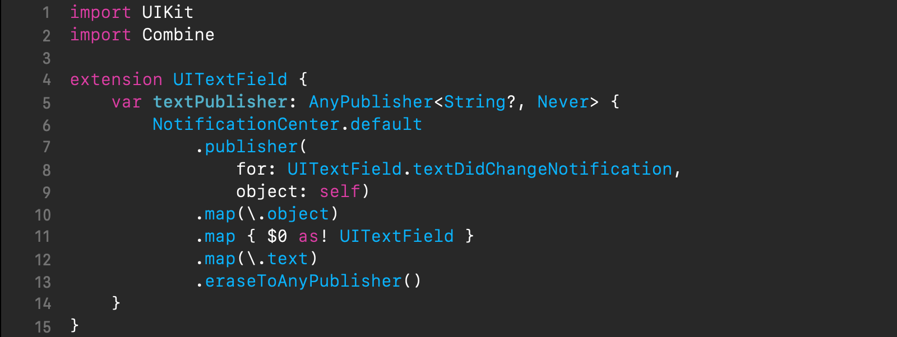
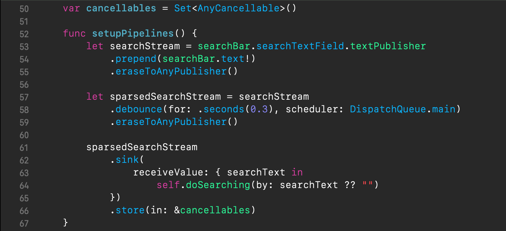
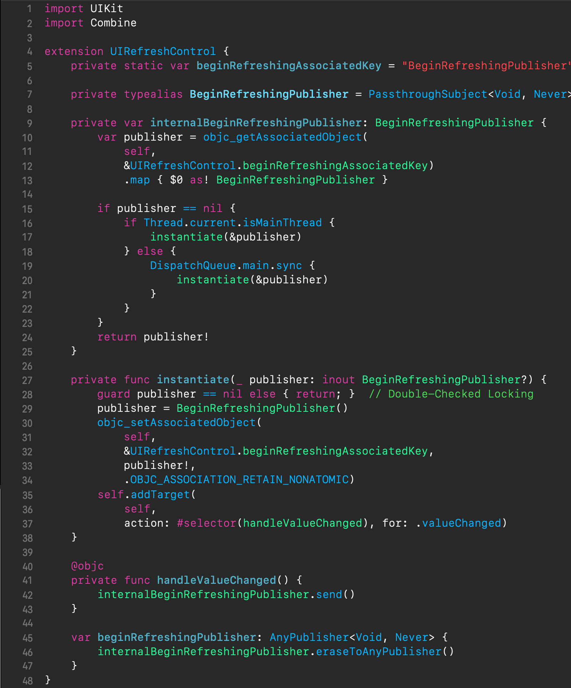
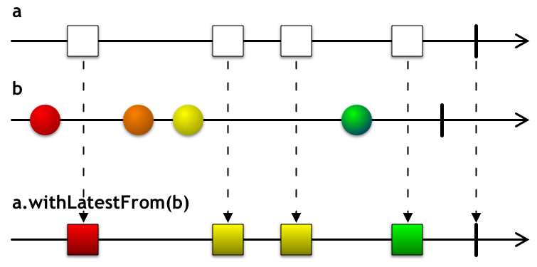
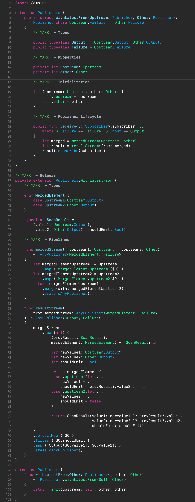
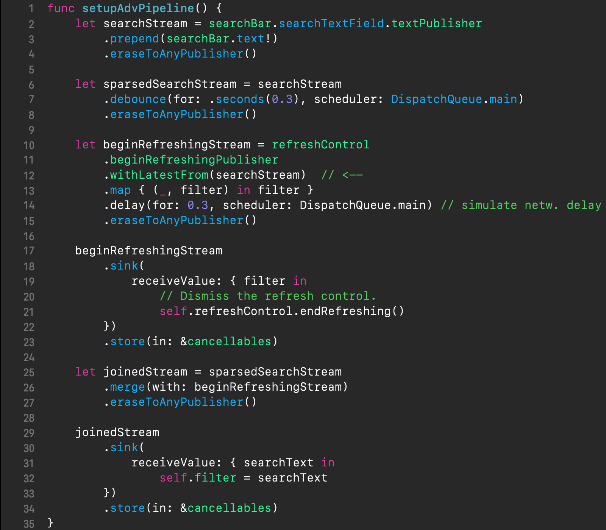

{: .center-image}

## Table of contents

- [Intro](#intro)
- [Search Bar integration](#search-bar-integration)
- [Building pipelines](#building-pipelines)
- [Refresh Control integration](#refresh-control-integration)
- [Introducing withLatestFrom operator](#introducing-withlatestfrom-operator)
- [Leveraging withLatestFrom operator](#leveraging-withlatestfrom-operator)
- [Wrap up](#wrap-up)

## Intro

Despite Apple's promoting their new [SwiftUI][swiftui] framework, there're a lot of projects, based on the plain old UIKit framework. Nevertheless, even if this is the case, and you're tied to UIKit, there's nothing that gets in the way of adopting [Combine][combine].

To leverage Combine [pipelines][pipelines] with UIKit, the used UIKit controls have to be integrated with Combine. In general, once that's done, further work just boils down to establishing *pipelines* transforming streams of control events and input values.

In this post, we'll walk through how in the [RP][reactive_programming] paradigm with Combine we can implement one practical case: presenting content with the UIKit table view and using a search bar for filtering. Moreover, we'll prefer a dynamic behavior for the search: as the text in the search field changes, the search results in the table view get automatically updated.

Notice, we're going to focus only on important details. If you wish to check out the completed app demonstrating a discussed material, download its Xcode project from [here][demo_project].

## Search Bar integration

We're going to use [`UISearchBar`][uisearchbar] as a filtering control; let's start with integrating it with Combine.

`UISearchBar` provides a text field for entering text that is vended in the property `searchTextField` of type [`UISearchTextField`][uisearchtextfield]. The `UISearchTextField` subclasses [`UITextField`][uitextfield] which is a good candidate for attaching a publisher of text changes. We can integrate `UISearchBar` with Combine as shown below.

{: height="100%" width="100%" .center-image }

In the above code, we're extending `UITextField` type to retroactively add a publisher of text changes, the property `textPublisher` of erased type `AnyPublisher<String?, Never>`. It's backed by the `NotificationCenter` publisher, on the default center, which is set up to emit the `.textDidChangeNotification` notifications produced by the underlying text field instance (*lines 7-9*). Next in the pipeline, we're picking `Notification`'s  `object` field (*line 10*), downcasting it back to `UITextField` (*line 11*), picking its `text` field (*line 12*), and erasing the publisher type (*line 13*).

## Building pipelines

Now that `UITextField` text publisher has been set up, we can go ahead and establish the search requests processing pipelines, as shown below.

{: height="100%" width="100%" .center-image }

We start by defining the `searchStream` pipeline (*line 53-55*). To refer to the search bar's text publisher we're writing `searchBar.searchTextField.textPublisher` and then setting up prepending the produced stream with the current value from `searchBar.text!` (*line 54*) to get the search results generated initially. Thus, the user's every single tap on the keyboard will trigger search results generation. But can you see any potential pitfalls here? The problem is that if the user is tapping fast enough and the search runs for every single tap, it can lead to a system overload. To avoid it, we limit the frequency of search requests by extending the previous pipeline with the [`debounce`][debounce] operator which will only emit the freshest received value upon an "undisturbed" delay of 0.3s (*line 58*).

Finally, our pipeline is terminating by the search results generation method subscribing to it (*lines 62-65*). Of course, we're storing the returned subscriber in the view controller's lifecycle bound storage, `cancellables`, (*line 66*) so as it won't immediately go out of existence.

## Refresh Control integration

To make things even more interesting we'll want to display the search results in a table view, which uses the [`UIRefreshControl`][uirefreshcontrol] for updating its contents. It means, that when the user pulls the top of the table view's contents area downward, a search results regeneration will be triggered to update the table view's contents area. 

First, as with `UISearchBar` we'll have to integrate `UIRefreshControl` with Combine as shown below.

{: height="100%" width="100%" .center-image }

In the code above, we continue to use Swift extensions to retroactively add a publisher of the refresh beginning events to `UIRefreshControl`. However, in contrast to `UISearchBar`, this time we're unable to take advantage of `NotificationCenter` publisher because there are no notifications sent for `UIRefreshControl`'s refresh beginning events. And so we're setting up our own events publishing, backed by a `PassthroughSubject` publisher (*line 7*).

The major complication has been here that as yet Swift doesn't support stored instance properties in extensions, and, as a workaround, we've used Apple SDK's associated objects facility. Via the computed property `beginRefreshingPublisher` (*line 45*), backed by `internalBeginRefreshingPublisher` (*line 9*), we're both instantiating and accessing the publisher's associated object that is created only once for a `UIRefreshControl` instance.

From the `instantiate(_:)` method we're registering the target-action handler `handleValueChanged()` to listen for `.valueChanged` events of `UIRefreshControl` indicating the refresh beginning (*line 35*). It's from `handleValueChanged()` that `beginRefreshingPublisher` is signalling about the refresh beginning (*line 42*). That's it.

## Introducing withLatestFrom operator

Now, that our used UIKit source event controls are integrated with Combine we're ready to proceed with refreshing the search results upon `UIRefreshControl`'s signals. Of course, we're looking for an elegant solution. The clearest one that comes to mind would be based on the `withLatestFrom` operator, which should be familiar to those with a reactive programming background. The marble diagram of the `withLatestFrom` operator is shown below.

{: height="100%" width="100%" .center-image }

If we consider data streams from the perspective of their nature, in essence, they are sequences of elements in time, and their elements are fully determined by two characteristics: value and time. The `withLatestFrom` operator combines two upstreams by just using one characteristic from elements of one upstream and the opposite from elements of the other. In the record  `a.withLatestFrom(b)`, it means that this operator emits a current latest value from the `b` upstream at times of the `a` upstream's elements. However, as yet this operator is missing from the Combine framework. 

So go ahead and introduce our own implementation of the `withLatestFrom` operator, as shown below.

{: height="100%" width="100%" .center-image }

The above is the code of a fully-fledged operator. The `withLatestFrom` operator returns a "[cold][cold_observables]" publisher, meaning it creates a new identity for each new downstream subscriber. Let's step through the above code:

1. The class of `withLatestFrom` operator, `WithLatestFrom`, (*lines 4-33*) sits under the `Publishers` namespace. 

2. Its initializer takes two upstream publishers as the parameters `upstream` and `other`, which are preserved in private properties for future use (*lines 20-21*).

3. Upon subscription, in `receive(subscriber:)` (*line 29*), the operator establishes a new inner pipeline responsible for the operator logic.

4. The operator logic inner pipeline splits into two sub-pipelines `mergedStream` and `resultsStream` which join into one in `receive(subscriber:)` (*lines 29-31*).

5. One sub-pipeline `mergedStream` (*lines 51-61*) is responsible for combining upstream elements of two different types into one stream with elements of an algebraic sum type, the enum `MergedElement`, and delivering them in an interleaved sequence of elements.

6. The other sub-pipeline `resultsStream` (*lines 63-93*) uses the stateful operator `scan` *(line 68)* to transform the merged element sequence into another producing tuples of the running latest elements of both upstreams *(lines 85-86)* and the flag `shouldEmit` *(line 87)* indicating whether the element should not be filtered out. Then it performs filtering *(line 90)* and producing the operator's expected output *(line 91)*.

7. The `withLatestFrom` operator method is retroactively added to the `Publisher` type so as it was capable of building up Combine pipelines (*lines 97-101*).
   

Overall, our `withLatestFrom` operator is fully functional, especially for our purpose. Still, its completion logic remains subject to correction, which is out of the scope here. Check out the corrected implementation of our `withLatestFrom` operator in the [XCombine repository][xcombine_repository].

## Leveraging withLatestFrom operator

Time to update our pipelines. In the following code, we've incorporated the `withLatestFrom` operator-based logic for a search results regeneration upon refresh control events.

{: height="100%" width="100%" .center-image }

Let's step through what's changed:

1. We're defining the `beginRefreshingStream` pipeline (*lines 10-15*) whose purpose is to provide a stream of refresh beginning events. To refer to the refresh control publisher we're writing `refreshControl.beginRefreshingPublisher` (*lines 10-11*).
2. Next, we're piping the stream into the `withLatestFrom` operator to be a control events source for the provision the operator with times at which it should read the latest values from `searchStream` (*line 12*).
3. The `withLatestFrom` operator produces tuples of its both upstreams' elements combined. We're reducing `withLatestFrom`'s produced tuples to mere `searchStream` elements (*line 13*).
4. Upon the user pulling the refresh control downwards, we allow a visual indication of search regenaration to last for a while (0.3s) by using the [`delay`][delay] operator (*line 14*). It has the effect of delaying all pipeline events by 0.3s (which are delivered on the main thread).
5. We make two subscriptions to the `beginRefreshingStream` pipeline. The first one is to finish the refresh control's visual indication (*line 21*).
6. The second subscription is made by the `merge` operator to join the two search event streams, `sparsedSearchStream` and `beginRefreshingStream`, into one (*line 26*).
7. Finally, the pipeline of joined search events is terminating by the search results generation method subscribing to it (*lines 30-33*).

## Wrap up

In this blog post we've walked through the process of adopting Combine in a UIKit-based app. We integrated two UIKit controls, `UISearchBar` and `UIRefreshControl`, with Combine and defined reactive stream pipelines to establish the necessary logic. Apart from that, we developed our own `withLatestFrom` operator which is absent from Combine yet.

The completed app demonstrating a discussed material is available as Xcode project [here][demo_project].

Thanks for reading 🎈

[swiftui]: https://developer.apple.com/documentation/SwiftUI
[combine]: https://developer.apple.com/documentation/Combine
[pipelines]: https://www.apeth.com/UnderstandingCombine/start/startpipelines.html
[reactive_programming]: https://en.wikipedia.org/wiki/Reactive_programming
[uisearchbar]: https://developer.apple.com/documentation/uikit/UISearchBar
[uisearchtextfield]: https://developer.apple.com/documentation/uikit/UISearchTextField
[uitextfield]: https://developer.apple.com/documentation/uikit/UITextField
[debounce]: https://developer.apple.com/documentation/combine/publisher/debounce(for:scheduler:options:)
[uirefreshcontrol]: https://developer.apple.com/documentation/uikit/uirefreshcontrol
[cold_observables]: https://medium.com/@benlesh/hot-vs-cold-observables-f8094ed53339
[demo_project]: https://github.com/SergeBouts/blog-samples/tree/master/XCombineDemo-WithLatestFrom
[xcombine_repository]: https://github.com/SergeBouts/XCombine
[delay]: https://developer.apple.com/documentation/combine/publisher/delay(for:tolerance:scheduler:options:)
