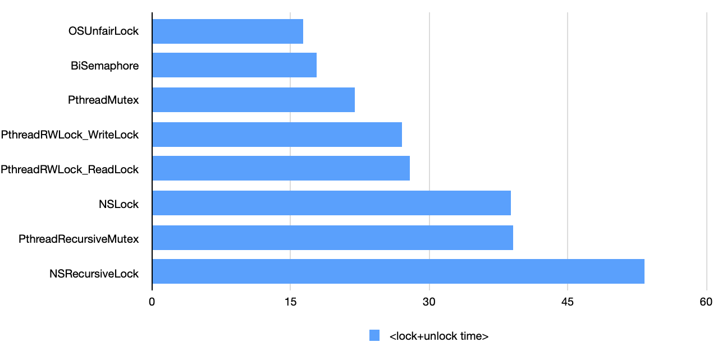

{: .center-image}

## Table of contents

- [Intro](#intro)
- [Mutex overview](#mutex-overview)
- [Mutex overhead](#mutex-overhead)
- [Benchmark](#benchmark)
- [Summary](#summary)

When designing *concurrent* programs, correctness is always the most important factor, but you should also consider *performance* factors as well. Code that executes correctly under multiple threads, but slower than the same code running on a single thread, is hardly an improvement. In this post, I *benchmark* the overhead of the acquisition/release time of different mutexes available on the _Apple_ platform. The results of this benchmark may be useful when you find yourself faced with choosing the right synchronization primitive.

## Intro

It is unlikely that a developer writing *concurrent* (*multithreaded*) code has not dealt with *mutexes* (or *locks*), which are the optimal tool for synchronizing mutliple threads. To refresh the memory, in a multithreaded program, access to a shared resource is organized through a limited region of code, also known as a *critical section* and a *mutex* is a program object that prevents simultaneous access to that region of code, i.e., guarantees **mut**ual **ex**clusion.

[The Little Book of Semaphores](http://alumni.cs.ucr.edu/~kishore/papers/semaphores.pdf) gives a mutex metaphor: it is a token that is passed from one thread to another. In an alternative metaphor there, we think of the critical section as a room, and only one thread is allowed to be in the room at a time. In this metaphor, mutexes are called *locks*, and a thread is said to *lock* the mutex before entering and *unlock* it while exiting. The thread that *acquires* (*locks*) the mutex is the *owner* of the mutex. Only after it *releases* (*unlocks*) the mutex, another thread can *acquire* the mutex and become the *owner*.

An ordinary mutex will *deadlock* if the thread-owner tries to lock the mutex again without first unlocking it. But a [*recursive mutex*](https://en.wikipedia.org/wiki/Reentrant_mutex) can be locked *multiple* times by a single thread.

## Mutex overview

On the *Apple* platform, a bunch of mutexes is available:

- [`os_unfair_lock`](https://developer.apple.com/documentation/os/1646466-os_unfair_lock_lock): a low-level effective lock, which is the replacement for the deprecated `OSSpinLock`, but instead of spinning on contention, it yields (i.e. it waits in the kernel to be woken up by an unlock). Its state currently fits in a *32-bit* integer, and the thread ownership information it comprises allows the system to [resist](https://developer.apple.com/documentation/os/1646466-os_unfair_lock_lock) priority inversions. As the name suggests it is unfair, meaning, a thread-unlocker can potentially immediately reacquire the lock before a woken up waiting thread gets an opportunity to attempt to acquire the lock. This is advantageous for performance reasons, but also makes starvation of waiting threads a possibility.

  (There also exists a *recursive* version, `os_unfair_recursive_lock`, but it's currently in a private API).

- [`pthread_mutex_t`](https://elias.rhi.hi.is/libc/Mutexes.html): a comprehensive *POSIX Threads* (*Pthreads*) mutex, which is provided by the lower-level C API. The size of its state structure is considerably larger than that of `os_unfair_lock`, *64 bytes*. By default it is configured [for *maximum speed* at the expense of correctness](https://2net.co.uk/tutorial/mutex_mutandis): not only is there no check of the *owner* and can any thread unlock it (as if it were a *binary semaphore*). No attempt of *priority inversion* resolution and *fairness* control is done either. But it can be configured to respect *fairness* and perform error checking and *priority inheritance*, if you prefer correctness over speed. A *Pthreads* mutex can also be configured for *recursion*. Finally, *Pthreads* mutex does support *condition variables*, that, among other things, allows you to establish a *wait timeout period*.

  In the benchmark, `pthread_mutex_t` comes as `PthreadMutex`.

- `pthread_rwlock_t`: a *Pthreads* implementation of a *read-write lock*. A *read-write lock* is an advanced mutex that allows concurrent access for read-only operations, while write operations require exclusive access, what is efficient in many scenarios. It has different operations for *read locking* and for *write locking*. The size of `pthread_rwlock_t` state structure is as much as *200 bytes*.

  In the benchmark, `pthread_rwlock_t` comes as `PthreadRWLock_WriteLock` and `PthreadRWLock_ReadLock` for *read* and *write locking* respectively.

- [`NSLock`](https://developer.apple.com/documentation/foundation/nslock/): a *Foundation*-provided *Objective-C* class for the most general-purpose mutex. Along with it come the classes [`NSRecursiveLock`](https://developer.apple.com/documentation/foundation/nsrecursivelock), [`NSConditionLock`](https://developer.apple.com/documentation/foundation/nsconditionlock), [`NSCondition`](https://developer.apple.com/documentation/foundation/nscondition), [`NSDistributedLock`](https://developer.apple.com/documentation/foundation/nsdistributedlock), each targeting its own set of problems. Essentially, they all are abstractions based on *Pthreads* mutex (on *macOS*/*iOS*) and therefore do nothing that cannot be done with *Pthreads* mutex, but are easier to use. 

  *Foundation* mutexes use the default (speed-oriented) *Pthreads* mutex configuration, but they are still somewhat slow. One reason they are slower than the non-*Objective-C* alternatives is the extra cost of having to go through *Objective-C* messaging system. Another reason is that they use a combination of a synchronization primitives, for example, they have to internally handle a *condition variable* to support functionality such as *wait timeouts*, which results in some overhead even when *wait timeouts* are not used.

- The `DispatchSemaphore` based [binary semaphore](https://www.geeksforgeeks.org/semaphores-in-process-synchronization/): although it is not a full-fledged mutex (because it [doesn't allow for ownership](https://blog.feabhas.com/2009/09/mutex-vs-semaphores-–-part-2-the-mutex/)) it still could be useful in [some cases](https://stackoverflow.com/questions/11528041/where-to-use-binary-semaphore-when-mutex-are-available#answer-11528296) and it looks promising in terms of performance:

  > A dispatch semaphore is an efficient implementation of a traditional counting semaphore. Dispatch semaphores *call down to the kernel only when the calling thread needs to be blocked*. If the calling semaphore does not need to block, no kernel call is made.
  >
  >  [Read more](https://developer.apple.com/documentation/dispatch/dispatchsemaphore)
  
  The binary semaphore usage:

  ```swift
  let biSema = DispatchSemaphore(value: 1)
  biSema.wait() // lock
  // critical section
  biSema.signal() // unlock
  ```
  
  In the benchmark, it comes as `BiSemaphore`.

## Mutex overhead

Mutexes are indispensable when it comes to *multithreaded synchronization*, but they also have overhead. Basically, any form of synchronization comes with a performance hit.

Major sources of mutex overhead are:

- the range of functionality provided by mutex implementation, such as *recursion*, *death detection*, *priority inheritance*, *wait timeouts*, control of thread *ownership*, etc ([read more](https://blog.feabhas.com/2009/09/mutex-vs-semaphores-–-part-2-the-mutex/))
- need to enter the *kernel* (read more: [1](https://stackoverflow.com/questions/39184037/lightweight-mutex#answer-39192864), [2](https://developer.apple.com/library/archive/documentation/Cocoa/Conceptual/Multithreading/ThreadSafety/ThreadSafety.html#//apple*ref/doc/uid/10000057i-CH8-SW10))
- *Objective-C* messaging (`objc_msgSend` calls) on the *Apple* platform ([read more](https://www.mulle-kybernetik.com/artikel/Optimization/opti-3.html))
- hardware-related causes ([read more](https://docs.microsoft.com/en-us/archive/msdn-magazine/2005/october/understanding-low-lock-techniques-in-multithreaded-apps))

Mutex *overhead* is the subject of interest of this benchmark. It can vary depending on what functionality the mutex has to use. For example, in the case of an *uncontended* call made from single process threads, the mutex may behave as a [lightweight mutex](https://stackoverflow.com/questions/39184037/lightweight-mutex#answer-39192864) and not to enter the *kernel*. Otherwise, a *kernel-mode* transition and a *wait list* enqueuing will be involved. Performance may also be affected by the need to handle *fairness* and prioritize threads. Being able to determine that a single thread is running allows the control flow to switch to a trivial code path.

Analyzing how mutexes behave under different circumstances and what overheads arise is valuable for concurrent software developers, as the knowledge gained will help improve software quality.

## Benchmark

In this [benchmark](https://github.com/serhiybutz/MutexBenchmark/blob/master/MutexBenchmark/main.swift), I compare the performance of mutexes in the absence of *contention* with a single thread is running. To get the cleanest possible results, the benchmark was performed from a command line tool application with the *Release* build configuration (for maximum optimization) and with the *Exclusive Access to Memory* runtime check disabled.

The following chart shows the benchmark results I got on a 3.1GHz Dual-Core Intel Core i7 with 16GM of RAM running macOS Catalina v10.15.3, deployment target 10.15. Time is given in **nano**seconds. 

{: .center-image}

The underlying simplicity of `OSUnfairLock` and `BiSemaphore` makes them leaders. `PthreadMutex`, being a higher level abstraction, is almost no different in performance, since it's tuned for speed.

The *Pthreads* read-write lock (for both read and write locking) is a bit slower in the diagram. In principle, this is expected because of its job complexity.

The performance of the ordinary *Foundation* lock, `NSLock`, virtually matches that of the recursive *Pthreads* mutex, `PthreadRecursiveMutex`, but its recursive companion `NSRecursiveLock` is the slowest. In general recursive versions are somewhat slower than their basic versions.

I have noticed that some items, such as the top two, sometimes tend to change their relative position from time to time. I assume that since these measurements are conducted at the limit of the processor's capability, side factors such as interrupts have a noticeable effect on the measurement results. Therefore, in order not to speculate, absolute values in the benchmark should be taken in moderation.

## Summary

To summarize, I find that the top three items can be thought of as equivalent in performance and overall the performance of all mutexes in the absence of contention is quite high.

I also benchmarked pairs of *contended* calls to the mutexes, and the overhead turned out to be 2 orders of magnitude higher! And for a relatively small number of measurements, it even jumped up to 3 orders of magnitude! Since the arrangement of items in the benchmark varied quite chaotically from time to time, I decided not to present a diagram for them. If you are curious, you can download my [benchmark project](https://github.com/serhiybutz/MutexBenchmark) and play with it yourself. Still, some items behaved steadily as opposed to the others, like the `BiSemaphore` and `OSUnfairLock`: the measurements (the total time of the *lock* operation immediately followed by the *unlock* operation) for them mostly varied in the range of *8-10 **micro**seconds*. Such a drastic degradation in performance is caused by the need for a thread to enter the kernel, go to the sleeping state and the subsequent awakening.

You can find the benchmark Xcode project in this [repository](https://github.com/serhiybutz/MutexBenchmark).

Thanks for reading 🎈
