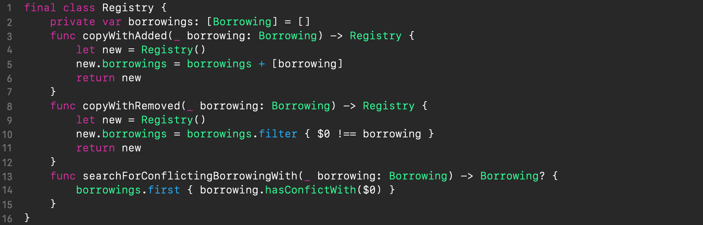

---

layout: post
title:  "Swift: Shared memory manager"
date:   2020-05-27 13:21:26 +0300
categories: [swift, ios, macos, concurrency, mutex, lock, synchronization, multithreading, shared-memory, mutex-synchronization, memory]
---

Memory allows the computational process to keep track of its state to make progress, so memory working skills are crucial for programmers. But in today's computing systems, where multiple threads of execution operate simultaneously, the complexity of working with memory takes on a new dimension.

When a correctly written program is executed in a single thread, its state changes sequentially according to the algorithm, and the result of the computation can be obtained from the state at completion. Even multiple concurrent (operating in parallel) threads, each running sequentially, as long as they do not communicate via shared memory, can safely obtain the desired results. But when different concurrent threads share memory, difficulties arise because the shared memory may be in an intermediate, incoherent state and when that undesirable situation occurs, the program may get the wrong result or even crash. In order to prevent this, we must use *thread synchronization*, i.e. to ensure that problematic shared memory objects can only be accessed *exclusively* by one thread at any given time (in fact, this requirement is imposed if at least one thread requires modification access). Thus, the memory state will always be observed by multiple threads in a coherent state.

In *Swift*, a commonly recommended way to achieve *exclusive mutual memory access* is to leverage [*Dispatch queues*](https://developer.apple.com/documentation/dispatch/dispatchqueue), implementing either the *EREW* (*Exclusive Read, Exclusive Write*) approach (based on serial queues) or *CREW* (*Concurrent Read, Exclusive Write*) approach (based on concurrent queues). Here are [examples](https://github.com/nodes-ios/SwiftSafe/blob/master/Safe/Safe.swift) of both.

Apple's documentation [states](https://developer.apple.com/library/archive/documentation/General/Conceptual/ConcurrencyProgrammingGuide/ThreadMigration/ThreadMigration.html#//apple_ref/doc/uid/TP40008091-CH105-SW3):
> Replacing your lock-based code with queues **eliminates many of the penalties associated with locks** and also simplifies your remaining code. Instead of using a lock to protect a shared resource, you can instead create a queue to serialize the tasks that access that resource. **Queues do not impose the same penalties as locks.** For example, queueing a task does not require trapping into the kernel to acquire a mutex.

However, when I benchmarked submitting a task closure to a queue on my macbook (3.1GHz Intel Core i7) I got an overhead of 200*ns* for a non-capturing task closure and 500*ns* for a capturing closure. Since today's *lock* implementations don't trap into the kernel for uncontended calls, the overhead of an uncontended lock operation is an order of magnitude lower, e.g., [`NSLock`'s `lock`/`unlock` takes approx. 40ns](https://sergebouts.github.io/swift-mutex-benchmark/). In most cases, the use of *Dispatch queues* is justified, but there're still situations where we want to achieve the best possible performance, and then we have to seek different opportunities with lower-level synchronization primitives, such as `NSLock` or `os_unfair_lock`.

In this post, we will review the traditional state synchronization strategy with *lock* (aka *mutex*) and work out a more promising one. We will develop a concurrent construct for more organic synchronization of shared memory accesses. It will be interesting first of all for those who seek to write efficient parallel programs in *Swift*.

## Mutexes

The intricacy of achieving *exclusive mutual memory access* by threads is there is no way to achieve this except indirectly, by controlling exclusive access to the *program code* regions that access shared memory, not memory itself. Such code regions are called [*critical sections*](https://en.wikipedia.org/wiki/Critical_section). The undesirable situation when multiple threads fall into a *critical section* is called [*race conditions*](https://docs.microsoft.com/en-us/archive/msdn-magazine/2005/august/concurrency-what-every-dev-must-know-about-multithreaded-apps#title-2-1_2-2) (or simply *races*). 

<div align="center">
    
</div>

The predominant way to prevent races in a critical section is to protect it with a program object called [*mutex*](https://en.wikipedia.org/wiki/Mutual_exclusion) (for **mu**tual **ex**clusion; also known as *lock*). *Mutex* provides a pair of methods *acquire* (alternatively *lock*) and *release* (alternatively *unlock*). Whenever one thread calls *acquire*, all attempts by other threads to call *acquire* cause them to wait (go to the sleeping state, or also block) until *release* is called. The thread that acquired the mutex is *owner* of the mutex, and it must release the mutex when it is done with the shared memory so that the other threads can access it. Since only one thread can be the owner of a mutex at a time, this assures mutual exclusion. 

Example of usage:

```swift
mutex.lock()
// critical section begins
balance -= cost
// critical section ends
mutex.unlock()
```


## *Mutex-to-memory* strategy<a id="mutex-to-operation-memory"></a>

If we abstract away a bit and look at the program state as such, we can think of it as a set of some modeled *program properties* which are stored in memory (aka *memory/concurrent objects*; not to be confused with *Swift* properties). It’s crucial for the program's correctness that its *properties* hold true (or be *invariant*) whenever they are meant to be used.

*Properties* can be expressed as *primitive* data types as well as *composite* data types. Operations on primitive data types can be *atomic*, and when this is the case, such data types cannot be caught off guard by other threads in an intermediate, incoherent state, and yet, in general, their such intrinsic safety is platform-dependent. Composite data types, on the other hand, are always vulnerable to being seen by other threads in an intermediate state. Therefore, we need to enclose concurrent code regions dealing with *any* data types in critical sections to make sure that the view of the *program properties* by other threads is always coherent.

The predominant basic principle is to *methodically* associate a particular *mutex* with a particular *program property* (a particular region of memory) that it protects. In practice, this means that all *critical sections* related to a particular *property* are protected by the *property*'s own *mutex*. The *methodicality* of the association (aka [methodical locking](https://docs.microsoft.com/en-us/archive/msdn-magazine/2005/august/concurrency-what-every-dev-must-know-about-multithreaded-apps)) helps to ensure that the `mutex`-based synchronization is maintained correctly in an extending program. For the sake of simplicity, we will refer to it as *mutex-to-memory strategy*.

To make life easier for programmers, some languages (like *Java* or *C#*) offer built-in functionality of *thread-safe classes* (also known as [*monitors*](https://en.wikipedia.org/wiki/Monitor_(synchronization))) to facilitate the synchronization of composite data types, which are essentially just syntactic sugar. For example, *Java* classes offer a special attribute *synchronized* for methods, which allows you to easily turn the method body into a *critical section*. Indeed, why not [piggyback on the data abstraction](https://docs.microsoft.com/en-us/archive/msdn-magazine/2005/august/concurrency-what-every-dev-must-know-about-multithreaded-apps) that is already present in an object-oriented design, namely *encapsulation*, and additionally guarantee synchronized instance state? If *program properties* are based on *thread-safe classes*, this guarantees their *invariance*. Thread-safe classes can be customly implemented in *Swift* likewise.

## Is *mutex-to-memory* strategy optimal?

Generally speaking, a program only makes sense when it is capable of progressing through transformations in its state. There either the user triggers a desired operation, or the program algorithm, relying on the *program properties*, performs certain computations and stepwise updates its state, and eventually the program transforms its state to some coherent, correct form. Basically, any program state transformation can be seen as one or more discrete steps between which the state is correct. Although correctness is always the most important factor when synchronizing shared memory accesses across multiple threads, *efficiency* should also be considered, because inefficient synchronization can easily cause a program with multiple threads to run slower than the same code executed in a single thread.

As a simple example, consider the following traffic accounting class that keeps track of the remaining money on the account (in `balance`) and the traffic consumed (in `traffic`), which constitute the *program properties*.


<p align="center"><a href="https://gist.github.com/SergeBouts/bffaa0746286020e1191062abd32f869" target="_blank">Click for Gist</a></p>

Its *API* is divided into 2 parts depending on the type of interaction with the state: [*queries* and *commands*](https://en.wikipedia.org/wiki/Command%E2%80%93query_separation). The *queries* use *read-only* access, and in the above example these are the simple `currentBalance` and `currentTraffic` computed properties, each with *read-only* access to one *property*, and the composite property `summary`, which has *read-only* access to both of these *properties*. The latter is useful for combined reporting. The *commands* (which are also [*transactions*](https://en.wikipedia.org/wiki/Transaction_processing)) use *read-write* access, and in the above example these are the `topUp(for:)` and `consume(:at:)` methods for funding the account and deducting funds for consumed traffic, respectively. The latter, in addition to performing a side effect, also returns the actual amount of consumed traffic from the requested traffic.

The above code is fine when used in a single-threaded environment, but it's not at all safe in a multi-threaded environment. So we have to synchronize the accesses:
1. all *read-write* (state-modifying) accesses to the *properties* must be carefully synchronized
2. since there is state modification, the *read-only* accesses to the *properties* must also be synchronized.

The most intuitive way to synchronize access to the *properties* is to apply *mutex-to-memory* strategy, i.e., to use a single *mutex* and simply enclose all the method bodies in `lock`/`unlock` calls. And that's exactly what *monitor* syntactic sugar would actually do behind the scenes. 

Now let's take a closer look at the accesses used in the operations. In some of the operations, we only need to access one or the other *property*, but not both at once, and therefore locking the entire state for each operation is an overkill leading to performance degradation. Each of the state transformations with the *mutex-to-memory* strategy corresponds to one unified formula:
<p align="center">state′ = 𝐹(state)</p>
This is a too coarse-grained formula since the semantics of our traffic account entity allows for more fine-grained transformations across the operations with different interdependencies between state chunks (*program properties*), such as:
<p align="center">state.x′ = 𝐹<sub>1</sub>(state.x)</p>
<p align="center">state.y′ = 𝐹<sub>2</sub>(state.y)</p>
<p align="center">z = 𝐹<sub>3</sub>(state.x, state.y)</p>
Hence, the granularity of synchronization when using the *mutex-to-memory* strategy leaves much to be desired and we can try to find a better mutual exclusion strategy, other than *mutex-to-memory*, which allows for better granularity but does not disrupt the program store state logic.


## Meet *mutex-to-operation* strategy<a id="mutex-to-operation-strategy"></a>

As seen in the previous section, synchronization based on the association of a particular mutex with a particular memory region is not always optimal. This is because the best strategy lives somewhere in another dimension. We want to dynamically operate on groups of memory objects *on a per-operation basis*. These memory objects are essentially the source properties and the destination properties of a program that are involved in state mutations. And for the time of a particular state-mutation operation, we want to preserve the *properties* from access by other parties – put another way, an operation should temporarily *own* or *borrow* (conventional terms) the *properties* for its *exclusive* use. This will allow us to achieve [transaction processing](https://en.wikipedia.org/wiki/Transaction_processing).

An abstraction of tracking access to *property groups*, which we will call *<span name="borrowing">Borrowing</span>*, becomes apparent. It's illustrated in the figure below. When an operation is triggered in the thread, a new *Borrowing* instance with a group of borrowed *properties* is activated with *Shared Manager*. *Shared Manager* only activates the borrowing if that does not pose a shared *property* use conflict. To do this, *Shared Manager* checks for conflicts with already active borrowings, and if a conflict is detected, the original thread is blocked (put to sleep) until the blocking borrowing is revoked, after which the original thread is awakened back. The original thread tries to activate its borrowing with *Shared Manager* again and repeats this until it succeeds. Only then can the operation on the shared properties be safely performed, at the end of which the original thread revokes the operation's borrowing.

{: .center-image}

This is an alternative thread synchronization approach, which we'll call *mutex-to-operation strategy*.

The great advantage of this solution is that it, if implemented reentrantably, has the potential of composability, unlike, for example, *monitor*. This means that the programmer can build an app in a modular way, relying only on each component's interface, without looking at its implementation. And internally, the thread safety of each component can rely on its own *Shared Manager*, which is hidden from the outside world behind the components interface. Different abstraction layers of a concurrent object can use their own *Shared Manager*.

Another noticeable advantage of *mutex-to-operation strategy* is that this solution is extremely scalable in the sense that it allows using a single instance of *Shared Manager* throughout the application, for example, as a singleton. Leveraging a single instance of *Shared Manager* breaks the [circular wait deadlock condition](https://en.wikipedia.org/wiki/Deadlock#Necessary_conditions) because there's always one active borrowing owned by an unblocked thread, which eventually revokes its borrowing at the end of the operation and makes way for other threads to proceed.

## Implementation in *Swift*

We will develop a module that provides *Shared Manager* for a custom synchronization construct for *mutex-to-operation* strategy described, and we'll start off with the *API*.

First, we need to somehow represent the *property* of the program so that we can refer to it from the code. To this end, we will have a generic class `Property`, parameterized by the type of property it represents. To note, the value of the property itself is not part of the *API* (not directly accessible by the client code). We'll protect it by the *internal* access modifier (actually, it's by default), which makes it inaccessible outside the module.

Another detail about shared *program properties* is that *Shared Manager* needs to distinguish them from each other without any introspection, i.e., they must have the quality of *identity*. Reference semantics of the `class` type will ensure this.

{: height="100%" width="100%" }
<p align="center"><a href="https://gist.github.com/SergeBouts/3fef97a3a444571cc91bcbb36ffd6a79" target="_blank">Click for Gist</a></p>

To provide access to *program properties*, we will have a special accessor to be supplied by *Shared Manager* for each given *property* in the *access blocks* ([see below](#access_block)). In fact, it is a wrapper for the *program property* whose *API* is comprised of a single `value` property, which provides access to the *property* itself.

We will use the `struct` type for accessors because of its value semantics, which gives better opportunities for [compiler optimization](https://developer.apple.com/videos/play/wwdc2015/409/) and the advantage of memory access [exclusivity enforcement](https://swift.org/blog/swift-5-exclusivity/):

{: height="100%" width="100%" }

<p align="center"><a href="https://gist.github.com/SergeBouts/0aa9a95f3911ef3aa0022ad671f5914a" target="_blank">Click for Gist</a></p>

As the *API* for *Shared Manager*, we'll have the concise [higher-order](https://en.wikipedia.org/wiki/Higher-order_function#Swift) functions `borrow()` (see the below code) whose arguments will be the desired *program properties* followed by a trailing closure of an <span id="access_block">*access block*</span>. *Access block* will be called  by the *borrow()* function either immediately if the *properties* are not in use, or, otherwise, right after they become available. The *access block* receives the accessors of the desired properties as arguments, which is the only way to access the values of the *properties*.

To be able to use an arbitrary number of desired *properties*, we will have the `borrow()` functions defined *n* times, with the number of *property* arguments growing from 1 to *n*, which are wrappers over the `internalBorrow()` method that performs the actual functionality. The code below illustrates this approach for *n* = 2. Notice how these wrapper methods forward their call to the `internalBorrow()` method with the *properties* passed in an array – in this way we achieve scalability.

{: height="100%" width="100%" }

<p align="center"><a href="https://gist.github.com/SergeBouts/ef9954be6571a9cdeec269a1004188a4" target="_blank">Click for Gist</a></p>

Now that we're done with the *API* of *Shared Manager*, let's get down to implementing its internal logic.

We'll start with the *Borrowing* ([see above](#borrowing)) implementation, and below is the code of the `Borrowing` class. Instances of `Borrowing` are created on a per-operation basis. The `props` property contains a list of the borrowed *properties* and is used in the `hasConflictWith` method. As mentioned above, the only information `Shared Manager` uses internally about *properties* is their *identity*, which is exactly what the `AnyObject` type provides, which is used to reference the borrowed *properties*.

The lifetime of an instance of `Borrowing` matches that of the operation, so it's the appropriate location for a mutex that will block conflicting threads either. As for the mutex itself, we need a bit different behavior – one that allows us to implement thread blocking that can be controlled from an unblocked thread. When an operation in one thread tries to borrow a *property*, while another operation in another thread owns that *property*, the former operation should be blocked until the latter finishes owning the conflicting *property*. The owning thread is responsible for unblocking waiting threads, if any, once the borrowing is complete.

The described behavior can be implemented using existing *OS* synchronization constructs – [conditions](https://developer.apple.com/documentation/foundation/nscondition). The code of the `Borrowing` class below fulfills such blocking. The `wait()` method contains the blocking part through which the threads enter the sleeping state and wait until the `isRevoked` flag is set. The unblocking part is in the `revoke()` method, and this is where the `isRevoked` flag is set. The `isRevoked` flag is accompanied by a special synchronization construct – the [condition variable](https://developer.apple.com/documentation/foundation/nscondition). The `Borrowing` instances have a single-use lifecycle.

{: height="100%" width="100%" }
<p align="center"><a href="https://gist.github.com/SergeBouts/2fd29ac4319c5f02e70af390b6a73fd6" target="_blank">Click for Gist</a></p>

The `Registry` class is used for bookkeeping of all current borrowings and always reflects the current state of *Shared Manager*. An important aspect of its implementation is that any change in its state also causes a change of its *idenity*, which prevents [ABA problem](https://en.wikipedia.org/wiki/ABA_problem) in handling *Shared Manager* state in a concurrent environment. Therefore, the *API* of `Registry` uses methods such as `copyWithAdded()` and `copyWithRemoved()` to assure this.

The `searchForConflictingBorrowingWith()` method searches for an active conflicting borrowing for a new one.

{: height="100%" width="100%" }

<p align="center"><a href="https://gist.github.com/SergeBouts/1c4323c2bbc5ae754b9bd4c4b5269b59" target="_blank">Click for Gist</a></p>

*Shared Manager*, implemented in the `SharedManager` class of the same name (see the below code), is the glue and at the same time the facade for all parties involved. Its *API* is a single `internalBorrow()` method which incorporates all the logic of our synchronization construct and occurs in 3 phases: 

1. creation and activation of a *borrowing* (via the helper method `activateBorrowingFor()`)
2. execution of the passed *access block* (via the passed in closure `accessBlock`)
3. and deactivation of the *borrowing* (via the helper method `deactivateBorrowing()`)

The method `activateBorrowingFor()` is quite complex, because it is responsible for maintaining the state of the entire construct (namely the *borrowing* registry) in a competitive environment. Its main complication is that we can't lock the registry for the entire time the `internalBorrow()` method works, because in some code paths, which is when the borrowed *property* is already owned, the thread should go to sleep, and due to double locking it will end up deadlocked. Therefore, to avoid such a situation, we only temporarily block the access to the *registry* just to read it into a local variable (lines 14-16) on entry. Then we continue with the *registry* unblocked, and on exit we block it again (line 23-29) to commit the changes. That said, when exiting, we first check if the *registry* has been changed by another thread (line 25), and if so, the whole transaction must be repeated from the beginning. Otherwise, the synchronization logic is broken, which leads to race conditions. If the *registry* has not changed, then we save the new *registry* and exit the `activateBorrowingFor()` method. It is very important to have protection against [ABA problem](https://en.wikipedia.org/wiki/ABA_problem), because the newly borrowed *properties* can coincide with the other ones in the *registry* swapped by other threads running in parallel. (In terms of *linearizability*, we have implemented a *nonblocking* algorithm with line 25 being the [*linearization point*](https://en.wikipedia.org/wiki/Linearizability#Linearization_points))

Last but not the least, in the `defer` section in the method `internalBorrow()` (lines 7-8), in addition to and after deactivating the created *borrowing*, its revocation is necessarily performed to unblock the waiting threads, if any.

{: height="100%" width="100%" }
<p align="center"><a href="https://gist.github.com/SergeBouts/6bf8eb8036824542ffad9920daa9325b" target="_blank">Click for Gist</a></p>


## Example of usage

Finally, let's see how we can apply the synchronization construct we developed for the *mutex-to-operation* strategy in our [`TrafficAccount` class example](#traffic-account-class-example-original) above:


<p align="center"><a href="https://gist.github.com/SergeBouts/e650dce7010aa0e52e5fc4d99e19ab29" target="_blank">Click for Gist</a></p>

In fact, the code structure has not changed at all. Now the *properties* of `balance` and `traffic` are wrapped in the `Property` class (lines 4-5). We added the `sharedManager` property for the `SharedManager` instance (line 7). And we put the body of each operation in the access block of Shared Manager's `borrow()` method argument, which follows the arguments of the *properties* used. Notice, how we refer to the *property* values inside the access block – they translate into closure's arguments as accessors (`Accessor` struct instances), and we always use the `value` property of the accessor.


## Conclusion

In this article, we saw that working with memory in multi-threaded programs is hard and that access to shared memory needs to be synchronized. Next, we saw that *mutex* is a universal synchronization mechanism, and we reviewed the predominant methodology for working with *mutexes*, which is to associate a particular *mutex* with a particular memory region(s). We referred to it as *mutex-to-memory strategy*. Next, using the example of a traffic accounting class, we saw how this methodology can be unoptimal and further we discussed how we can do better with an approach of associating a specific *mutex* with a specific operation, which we named *mutex-to-operation strategy*. Next, we developed a custom synchronization construct for *mutex-to-operation strategy* and applied it to our original traffic accounting example.

In fact, there is still room for improvement in our synchronization construct, such as a more optimal handling of the properties of a program by separating accesses by their type: read-only or read-write, but this is not covered in this post. If you are interested in the finished implementation, it is available in this [repository](https://github.com/SergeBouts/Mitra/releases/tag/0.1.0).

Thank you for reading 🎈

